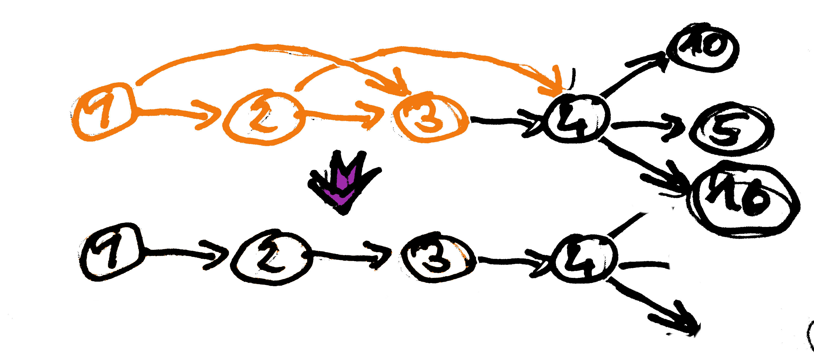
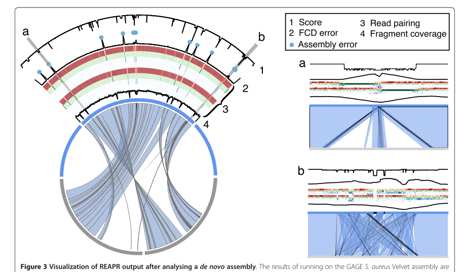

% PacBio <3 Illumina
% Married with Scaffolds
% Heinz Ekker (CSF.NGS) 2014-03-05

## PacBio <3 Illumina

### A short introduction to hybrid *de novo* genome assembly combining Illumina short reads with Pacbio long reads.

Pipeline scripts, markdown source code and data for assembly, analysis and presentation available at [https://github.com/h3kker/assemblyTalk](https://github.com/h3kker/assemblyTalk)

---

## Content

1. An Idiot's Guide to Assembly & PacBio Technology
1. Hybrid Assembly Strategies
1. The Data + The Results
1. Assembly Assessment
1. Outlook

# Assembly Basics

---

### Standard Assembly

---

### Error Correction

---

### Preprocessing

- Illumina Error Correction
- Error Correction of Pacbio reads using Short Reads (Illumina)
- Adapter trimming
- Quality trimming
- Deduplication

Some assemblers depend on other, existing tools to perform these steps or do one or more as part of the pipeline. 

---

### Graph Construction

---

### Graph Construction

---

### Graph Construction - Path Enumeration 

> They stared at the drinks were gone

> They stared at the drinks went gone

> They stared at the drinks the drinks were gone

> ....

> They stared at the drinks. The drinks went warm. They drank.

---

### Graph Construction - Strategies

**Overlap Consensus Layout, eg. Celera, SGA** 

Each read is represented by one node. Node 1 and 2 are connected if the end
of read 1 matches start of read 2 with a minimum overlap of *k*. The
parameter *k* determines how complex the graph will be (the lower it is the
more nodes are connected).  Limited by the data itself (polyploidity,
sequencing errors). The ideal assembly visits every node once (Hamilton Path).

String Graphs are a special variant where all transitive edges `((1,2), (1, 3),
(2, 3))` are reduced to `((1,3))`, to *irreducible edges*.

---

### Graph Construction - Strategies

**K-mer based, eg. Abyss, SOAPdenovo**

All reads are chopped into kmers, each kmer is represented by one node. Two
kmers are connected if there is a `k-1` overlap between the nodes (de Bruijn
graph). The ideal assembly visits each edge exactly once (Euler path). 

K-mer size (parameter *k*) should be chosen large enough to reduce the number
of wrong connections between contigs, but small enough to allow for errors.

*Hybrid strategies proposed: Combine contig and graph output from both types of assemblers.*

---

### Graph Simplification

Graph structure is very complex due to

- transitive edges like `((1,2), (1,3), (2,3))`
- consecutive nodes like `((1,2), (2,3), (3,4))`
- error reads (branches that converge again later)
- spurious branch points on repeat edges
- dead ends (tips)

---

### Graph Simplification - Remove Transitive Edges

Transitive Edges do not add additional information, they can be removed.

---

### Graph Simplification - Node Merging

Collapse nodes that connect unambiguously (without branching) into one node
representing the merged sequence.

---

### Graph Simplification - Dead End Removal

Sometimes also: tip erosion. Remove all nodes with connections only in one
direction. These can be caused by low coverage regions and read errors. Can
also shorten valid contigs!

---

### Graph Simplification - Bubble Popping

Bubbles due to sequencing errors or polyploid genomes, heterozygosity.
Selection of branch based on different criteria like coverage, quality.

---

### Graph Simplification - Repeat tangles

Formed in repeated regions, were many reconstructions are possible. Resolved by
forming parallel paths. Paired-End constraints can be used to discard invalid
edges (too short, too long reconstruction).

---

### Postprocessing

**Contigs**: Build contiguous stretches of sequence, filter and correct (consensus)

**Scaffolds**: Either with built-in scaffolder or external program. Most assemblers come with
their own scaffolder for PE or mate pair library information. Using Pacbio CLRs
not yet popular.

Missing sequence information is filled with N (assembly gaps)

---

### Postprocessing - Scaffolding

Use paired end information to join and orient contigs. Can also detect and filter misjoined contigs.

---

### Choosing your Assembler

They all follow the same principles! Main "unique selling points" seem to be
algorithms and data structures. The strategies and heuristics employed in graph
simplification and postprocessing make the difference in results.

---

### Differences between Assemblers ... and datasets

---

# PacBio Basics

---

## PacBio Basics

---

# Pacbio Error Correction

---

## PreAssembly and pacBioToCA

---

### pacBioToCA Error Correction

see [report.html](report.html#toc_17)

- Corrected reads are actually shorter than before.
- Computationally very intense (good for keeping clusters busy)
- Reduction in Depth makes assembly seem infeasible

---

### SMRTanalysis PreAssembler Workflow

see [report.html](report.html#toc_32)

- Fewer, even shorter reads
- Bad results, but minimal relaxation of alignment criteria produced ~200GB of alignment files which then could not be read
- Very sensitive to parameters for alignment between PacBio and Illumina Reads
- Mapping information between corrected and original reads, better diagnostics

---

### Resulting Reads

- Filtered Subreads: 40000 reads with 150 Mbp (~1.5x, mean length: 3750 bp)
- pacBioToEC: 55000 reads with 125 Mbp (~1.25x, mean length: 2300 bp)
- PreAssembly: 18000 reads with 15 Mbp (...)

---

# Hierarchical Assembly

Compensate for short read length by assembling high-fidelity Illumina reads (with high coverage) and resolve repeats and gaps using long Pacbio reads.

1. Run standard assembler
1. Use Cerulean or PBJelly to scaffold and fill gaps

Few assemblers have native support for including Pacbio CLRs (in contrast to Mate Pair and Sanger reads)

---

### Short-Read Assembly

Using 45M Illumina PE100 reads (~9 Gbp, 450x Coverage)

| Set | # >2kb | N50 | max |
|:---|-------:|----:|-------:|
| SOAP | 521 | 78347 | 280862 |
| SGA | 467 | 57237 | 199401 |
| Abyss | 698 | 51236 | 200210 |

---

## Improvement with Scaffolding Using Pacbio Reads

- Abyss + Longscaff
- Abyss + Cerulean
- any assembly + PBJelly

---

### Abyss + Cerulean or Longscaff

|set | # >2kb | N50 | max |
|:---|-------:|----:|-------:|
| scaffolds | 698 | 52136 | 200210 |
| longscaff | 475 | 81601 | 435667 |
| cerulean | 310 | 106883 | 366413 |

see [report.html](report.html#toc_42)

---

### PBJelly

|set | # >2kb | N50 | max |
|:---|-------:|----:|-------:|
| longscaff | 475 | 81601 | 435667 |
| cerulean | 310 | 106883 | 366413 |
| SOAP | 521 | 78347 | 280862 |
| SGA | 467 | 57237 | 199401 |

*Before*

|set | # >2kb | N50 | max |
|:---|-------:|----:|-------:|
| SGA | 183 | 234931 | 767671 |
| SOAP | 174 | 201830 | 541843 |
| Cerulean | 238 | 159023 | 489237 |

*After*

---

### All Contig Stats

---

## All Contig Stats

---

# Quality Checks For Assembly Assessment

---

## Size Is Not Everything 
## **Quality Assessment needed.**

But we do not have the luxury of **Assemblathon** or **GAGE** to have a reference to compare to!

---

### Alignment to Close Relative (*U. hordei*)

---

### Alignment of PacBio reads

Aligned with `bwa mem -a -T 60 -k 16 -A 2 -L 4 -t 8 -S -P -k 32`

---

### Alignment of PacBio reads

A number of contigs with very high depth (>300) were found - A random BLAST produced rDNA.

---

### CEGMA

---

### REAPR

> Hunt M, et al. Genome Biol. 2013

---

# Elsewhere...

---

### Pacbio Only Assembly

**Arabidopsis Ler-0 using P4 enzyme, C2 chemistry**

Genome size: 124.6 Mb, GC content: 33.92%
Raw data: 11 Gb, Assembly coverage: 15.37x
Polished Contigs: 540
Max Contig Length: 12.98 Mb
N50 Contig Length: 6.19 Mb
Sum of Contig Lengths: 124.57 Mb

http://blog.pacificbiosciences.com/2013/08/new-data-release-arabidopsis-assembly.html

---

### Pacbio Only Assembly

**Drosophila using P5 enzyme, C3 chemistry**

Total number of bases: 15,208,567,933 bp, Total number of reads: 1,514,730
Average read length: 10,040 bp, Half of sequenced bases in reads greater than:  14,214 bp
PacBio RS II instrument time for sequencing: 6 days, Number of SMRT® Cells: 42

Contigs: 128
Max Contig Length: 24.6 Mbp
N50: 15.3 Mb
Sum of Contig Lengths: 138.4 Mbp

http://blog.pacificbiosciences.com/2014/01/data-release-preliminary-de-novo.html

---

### Correction-Free Assembly

Cod and Salmon. Shown: Salmon (3GBp)

---

### Correction-Free Assembly

**Their Conclusions**

> 10-20x raw PacBio assemblies can yield 2-5x larger contig NG50 compared to short-read assemblies
>
> 10-20x raw PacBio assembly are not a finished product, but a good tool to have for improving short-read assemblies:
>
> - provides great amount of contiguity
>
> - useful for evaluation, gap closing, repeat resolution, scaffold joining
>
> 10-20x raw PacBio assemblies are a valuable alternative
>
> obtaining 100x coverage in raw PacBio reads is still too expensive for large genomes -> combine with short-read datasets and assemblies

**Outlook**

> Raw PacBio read error rates are not expected to improve 
>
> PacBio read lengths are getting longer
>
> Throughput is going up, hopefully reducing cost

---

### Pacbio Only

---

#### Literature

1. Simpson JT, Wong K, Jackman SD, et al. ABySS: a parallel assembler for short read sequence data. Genome Res. 2009;19(6):1117–23.
2. Bradnam KR, Fass JN, Alexandrov A, et al. Assemblathon 2: evaluating de novo methods of genome assembly in three vertebrate species. Gigascience. 2013;2(1):10. 
3. Deshpande V, Fung E, Pham S, Bafna V. Cerulean: A hybrid assembly using high throughput short and long reads. Algorithms Bioinforma. 2013;8126:349–363. 
4. Simpson JT, Durbin R. Efficient de novo assembly of large genomes using compressed data structures. Genome Res. 2012;22(3):549–56. 
5. Simpson J. Exploring Genome Characteristics and Sequence Quality Without a Reference. arXiv Prepr. 2013:1–29. 
6. Salzberg SL, Phillippy AM, Zimin A, et al. GAGE: A critical evaluation of genome assemblies and assembly algorithms. Genome Res. 2012;22(3):557–67. 
7. English AC, Richards S, Han Y, et al. Mind the gap: upgrading genomes with Pacific Biosciences RS long-read sequencing technology. PLoS One. 2012;7(11):e47768. 
8. El-Metwally S, Hamza T, Zakaria M, Helmy M. Next-Generation Sequence Assembly: Four Stages of Data Processing and Computational Challenges Markel S, ed. PLoS Comput. Biol. 2013;9(12):e1003345. 
9. Hunt M, Kikuchi T, Sanders M, et al. REAPR: a universal tool for genome assembly evaluation. Genome Biol. 2013;14(5):R47. 
10. Luo R, Liu B, Xie Y, et al. SOAPdenovo2: an empirically improved memory-efficient short-read de novo assembler. Gigascience. 2012;1(1):18. 
11. Boetzer M, Pirovano W. Toward almost closed genomes with GapFiller. Genome Biol. 2012;13(6):R56. 
12. Parra G, Bradnam K, Korf I. CEGMA: a pipeline to accurately annotate core genes in eukaryotic genomes. Bioinformatics. 2007;23(9):1061–7. 

---

# Thanks.

Slides, scripts, markdown source code and data for assembly, analysis and presentation available at [https://github.com/h3kker/assemblyTalk](https://github.com/h3kker/assemblyTalk)
