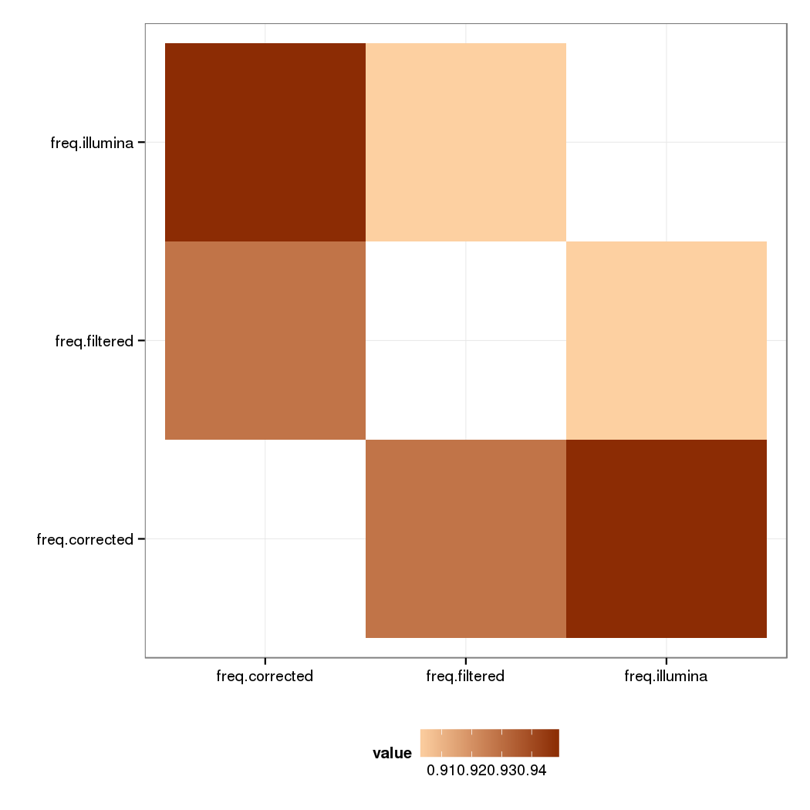
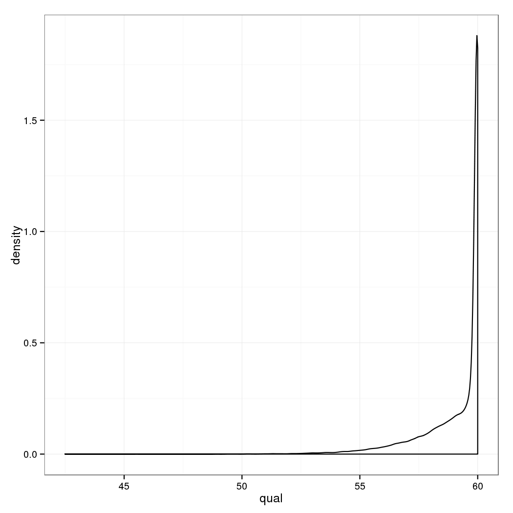
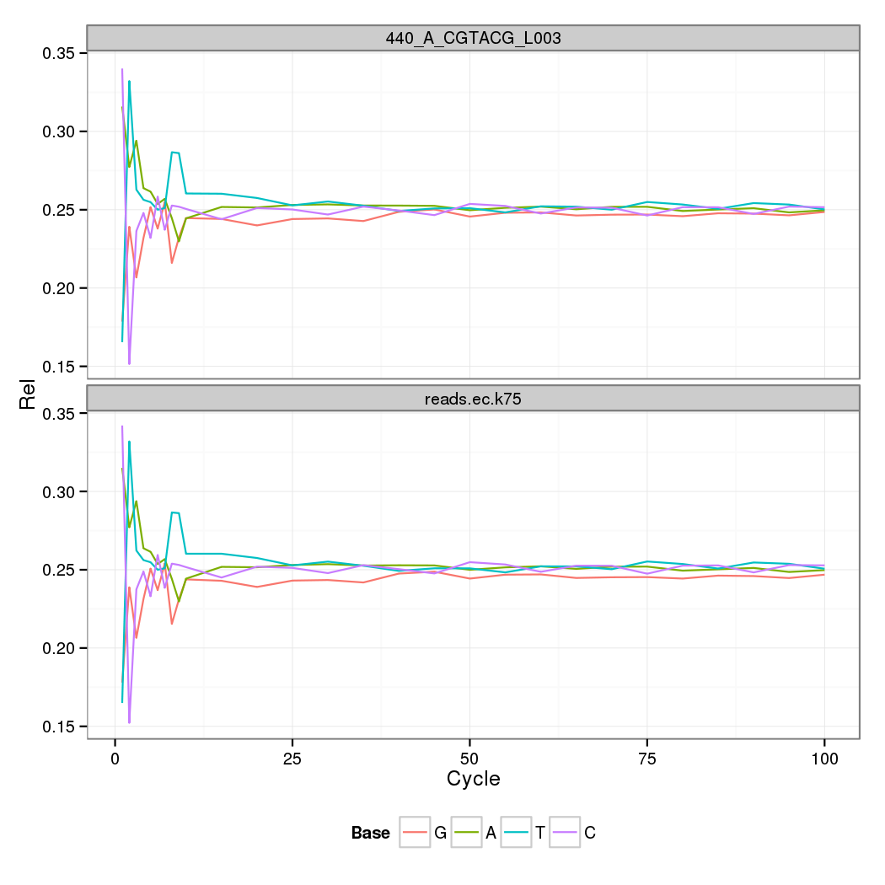
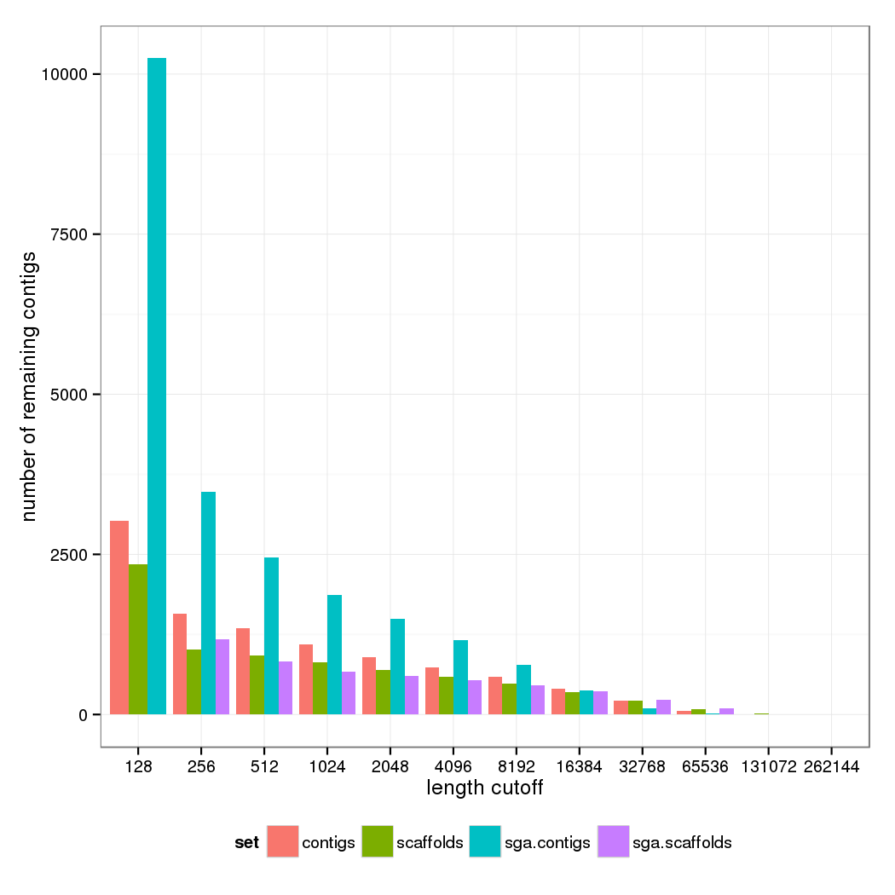
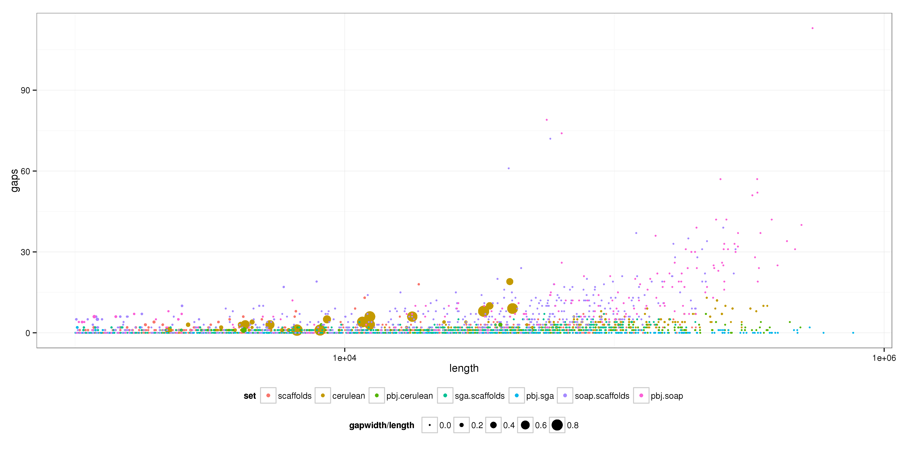

# *de novo* assembly of *U. bromivora*


## Data Sets and basic Quality Control


### PacBio long reads

#### Productive ZMWs:

|moviename                                                      |  productive|  subreads|  rounds|
|:--------------------------------------------------------------|-----------:|---------:|-------:|
|m131128_163657_42164_c100589642550000001823099704281491_s1_p0  |       17702|     23389|   1.321|
|m131129_160711_42164_c100589642550000001823099704281492_s1_p0  |       18359|     22626|   1.232|


#### Length distribution of filtered subreads:

|id     |  value|
|:------|------:|
|count  |  39697|
|0%     |    500|
|25%    |   1722|
|50%    |   2903|
|75%    |   5151|
|100%   |  20254|
|mean   |   3910|
|sd     |   3079|


#### Quality by cycle:


#### Qualities by read:


#### GC content


Note the bimodal distribution: a larger proportion of reads with around 52% GC and a smaller subpopulation with 36%. Preliminary analysis suggest that the smaller population could be mtDNA, but also bacterial. **TODO** show, analyse further (kmer partitioning/spectra?).


### Illumina PE100 reads

Stats calculated with fastqc.

     #!/bin/bash 
       
      /sw/lenny/arch/x86_64/FastQC/fastqc -o fastqc/ -t 4 illumina/440_A_CGTACG_L003.1.fastq 
      /sw/lenny/arch/x86_64/FastQC/fastqc -o fastqc/ -t 4 illumina/440_A_CGTACG_L003.2.fastq 
       
      # split result files to modules for easier parsing in R 
      for d in fastqc/440_A_CGTACG_L003.1_fastqc fastqc/440_A_CGTACG_L003.2_fastqc; do 
      	pushd $d 
      	perl ~solexa/bin/splitFastQC.pl fastqc_data.txt 
      	popd 
      done 
       


|id       |read   |Measure             |Value                      |
|:--------|:------|:-------------------|:--------------------------|
|read1.1  |read1  |Filename            |440_A_CGTACG_L003.1.fastq  |
|read1.2  |read1  |File type           |Conventional base calls    |
|read1.3  |read1  |Encoding            |Sanger / Illumina 1.9      |
|read1.4  |read1  |Total Sequences     |42264242                   |
|read1.5  |read1  |Filtered Sequences  |0                          |
|read1.6  |read1  |Sequence length     |101                        |
|read1.7  |read1  |%GC                 |49                         |
|read2.1  |read2  |Filename            |440_A_CGTACG_L003.2.fastq  |
|read2.2  |read2  |File type           |Conventional base calls    |
|read2.3  |read2  |Total Sequences     |42264242                   |
|read2.4  |read2  |Sequence length     |101                        |
|read2.5  |read2  |%GC                 |49                         |


#### Quality By Cycle


#### Mean Quality per Read


#### GC Content per Read


### Pre-QC

Preqc pipeline from SGA: 

> Simpson, J. Exploring Genome Characteristics and Sequence Quality Without a Reference. arXiv Prepr. 1–29 (2013). at <http://arxiv.org/abs/1307.8026>

Run on Illumina data set.

     #!/bin/bash 
      #$ -q public.q 
      #$ -pe smp 8 
      #$ -cwd 
      #$ -N sga_preqc 
       
       
      FQ_BASE="440_A_CGTACG_L003" 
      SGA_BIN=/groups/csf-ngs/bin/assembly/SGA/bin/sga 
      ln -sf ../illumina/${FQ_BASE}.{1,2}.fastq . 
       
      if [ ! -e $FQ_BASE.fastq ]; then 
      	$SGA_BIN preprocess --pe-mode 1 $FQ_BASE.{1,2}.fastq > $FQ_BASE.fastq 
      fi 
      if [ ! -e $FQ_BASE*fai ]; then 
      	$SGA_BIN index -a ropebwt -t 8 --no-reverse $FQ_BASE.fastq 
      fi 
      $SGA_BIN preqc -t 8 $FQ_BASE.fastq > $FQ_BASE.preqc 
       


Estimated Genome Size: 2.4807 &times; 10<sup>7</sup> bp.

#### Fragment size estimation

Mean: 211.3821 +/- 52.6065, median: 204


#### Kmer depth

This should be a bimodal distribution with a peak at low depths (for error kmers) and a second one at higher depths (correct kmers). Calculated for k=51. 


#### Graph branching

This measure is a predictor of the complexity of the assembly graph (number of
possibilities). In comparison to the provided test data sets, repeat and
variant branches look good, but the number of error branches is very high.

**XXX Illumina error correction?**


#### Simulated contig length N50

For estimating k. Should be chosen as high as possible.


## PacBioToCA Error Correction

See http://sourceforge.net/apps/mediawiki/wgs-assembler/index.php?title=PacBioToCA

Parameters for fragment (actually insert) size from PreQC and other (post-hoc) estimations.

     #!/bin/bash 
       
      module load gridengine 
       
      # source pacbio software, comes with the complete Celera assembly suite 
       
      . /groups/csf-ngs/bin/pacbio/smrtanalysis-2.0.1/etc/setup.sh 
       
       
      illuminaFrg=illuminaShortReads.frg 
       
      if [ ! -f $illuminaFrg ]; then 
      	# assume 220bp insert size +/- 50 - this conforms to various QC estimations (some post-hoc, i.e. from assembly tries) 
      	fastqToCA -libraryname illumina -insertsize 220 50 -technology illumina -type sanger -innie -mates illumina/440_A_CGTACG_L003.1.fastq,illumina/440_A_CGTACG_L003.2.fastq > $illuminaFrg 
      fi 
       
      pacBioToCA -length 500 -partitions 200 -l ec_pacbio -t 16 -s pacbio.spec -fastq filtered_subreads.fastq $illuminaFrg > run.out 2>&1 


Outputs Celera-specific frg and a pair of .fasta/.qual files. The latter can be converted to fastq using `faqual_to_fastq.py`

### New run 


|id        |  corrected|  filtered|
|:---------|----------:|---------:|
|count     |  55334.000|  39697.00|
|0%        |    299.000|    500.00|
|25%       |    885.000|   1722.00|
|50%       |   1622.000|   2903.00|
|75%       |   2982.000|   5151.00|
|100%      |  15953.000|  20254.00|
|mean      |   2357.252|   3909.69|
|sd        |   2152.592|   3079.00|
|coverage  |      6.522|      7.76|


#### Length distribution


#### Quality by cycle:


#### Qualities by read:


#### GC content


### Kmer correlation

Characterize changes from error correction by kmer spectrum of reads.


#### Error Corrected to Filtered

Good linear fit


relative frequency (log2 ratios) shows some patterns (not examined in detail)


#### Kmer correlation

Illumina kmer spectrum calculated on a random subset of 1M reads of illumina/440_A_CGTACG_L003_R1_001.fastq (memory consumption limits!). Celera error correction very aggressively turns the pacbio reads into illumina reads! The result has more to do with illumina than the original.




### Comparison with run with incomplete 2nd read

**Spoiler** only marginal differences


#### Basic

|id        |  old.corrected|  corrected|  filtered|
|:---------|--------------:|----------:|---------:|
|count     |       56619.00|  55334.000|  39697.00|
|0%        |         395.00|    299.000|    500.00|
|25%       |         852.00|    885.000|   1722.00|
|50%       |        1541.00|   1622.000|   2903.00|
|75%       |        2858.00|   2982.000|   5151.00|
|100%      |       15953.00|  15953.000|  20254.00|
|mean      |        2278.29|   2357.252|   3909.69|
|sd        |        2113.71|   2152.592|   3079.00|
|coverage  |           6.45|      6.522|      7.76|


#### Length distribution of corrected and filtered subreads:


#### Quality by cycle:


#### Qualities by read:




#### GC content


## Pacbio PreAssembly pipeline

A similar correction pipeline to pacBioToCA. Very difficult to run! 

`smrtpipe.py --distribute --output=result-nonsensitive/ --params=settings-nonsensitive.xml xml:input.xml &`

Compare settings in `settings.xml` and `settings-nonsensitive.xml`. The
minScore parameter for the `blasr` mapping seems to make all the difference. If
set too high: `align.b4` of illumina against pacbio grows to 120GB, subsequent
processing crashes. 

Complete pacbio run: needs to start from SMRTcell raw data!


### Stats

#### Basic

|id        |  filtered|  corrected|  preassembly|
|:---------|---------:|----------:|------------:|
|count     |  39697.00|  55334.000|    1.821e+04|
|0%        |    500.00|    299.000|    5.010e+02|
|25%       |   1722.00|    885.000|    5.670e+02|
|50%       |   2903.00|   1622.000|    6.680e+02|
|75%       |   5151.00|   2982.000|    8.550e+02|
|100%      |  20254.00|  15953.000|    3.776e+03|
|mean      |   3909.69|   2357.252|    7.644e+02|
|sd        |   3079.00|   2152.592|    2.934e+02|
|coverage  |      7.76|      6.522|    6.961e-01|


#### Length Distribution


#### GC content


## Abyss Assembly

> Simpson, J. T. et al. ABySS: a parallel assembler for short read sequence data. Genome Res. 19, 1117–23 (2009).

http://www.bcgsc.ca/platform/bioinfo/software/abyss

Version 1.3.7 from Dec 11, 2013 has the ability to use long reads (e.g. pacbio) to scaffold a short-read assembly, but has a few quirks (bugs) to work around.

     #!/bin/bash 
      #$ -q public.q 
      #$ -pe smp 4 
      #$ -cwd 
      #$ -N pacbio_k64_assembly 
       
      longreads=filtered_subreads.fastq 
      assembly=pacbio_abyss_k64 
       
      module load gridengine 
      #module load bwa 
      # use newer bwa (with mem)! 
       
      export PATH=/groups/csf-ngs/bin/align/bwa/bwa-0.7.5a:/groups/csf-ngs/bin/assembly/abyss-1.3.7/bin:/groups/csf-ngs/bin/assembly/abyss-1.3.7/ABYSS:$PATH 
       
      # unfortunately we're not allowed to submit to the openmpi queue, so we have to lie to abyss about running in single threaded mode 
      unset NSLOTS 
       
      if [ ! -d "abyss-k64" ]; then 
      	mkdir abyss-k64 
      fi 
       
      pushd abyss-k64 
      # it's important to put the file into the current path (bug in abyss) 
      ln -sf ../$longreads .  
      /groups/csf-ngs/bin/assembly/abyss-1.3.7/bin/abyss-pe -j 4 k=64 in='../illumina/440_A_CGTACG_L003.1.fastq ../illumina/440_A_CGTACG_L003.2.fastq' long=$longreads name=$assembly 
      # BUG in abyss - at this point there will be an error. we have to re-run the alignment manually 
      bwa mem -a -T 60 -k 16 -A 2 -L 4 -t2 -S -P -k64 $assembly-8.fa $longreads | gzip > $longreads-8.sam.gz 
      # restart abyss - it picks up the alignment and continues (the magic power of makefiles!) 
      /groups/csf-ngs/bin/assembly/abyss-1.3.7/bin/abyss-pe -j 4 k=64 in='../illumina/440_A_CGTACG_L003.1.fastq ../illumina/440_A_CGTACG_L003.2.fastq' long=$longreads name=$assembly 
      abyss-fac -d, *-{unitigs,contigs,scaffolds,long-scaffs}.fa | sed -e s/sum/sum,set/ > pacbio_abyss_k64.summary.csv 
      popd 


### Basic stats 

Abyss-fac output (all contigs >= 200bp):

|      n|  n.200|  n.N50|  min|    N80|    N50|     N20|     max|       sum|set                              |
|------:|------:|------:|----:|------:|------:|-------:|-------:|---------:|:--------------------------------|
|  14738|   4694|    346|  200|   6760|  17514|   32280|   94671|  20170000|pacbio_abyss_k64-unitigs.fa      |
|   8146|   1746|    167|  200|  16252|  38669|   71303|  174379|  20380000|pacbio_abyss_k64-contigs.fa      |
|   7243|   1084|    120|  200|  24221|  51236|   95736|  200210|  20370000|pacbio_abyss_k64-scaffolds.fa    |
|   6941|    782|     77|  200|  35386|  81601|  145621|  435667|  20350000|pacbio_abyss_k64-long-scaffs.fa  |


```
## Error: could not find function "contigStats"
```


Cumulative sum of contig lengths for all and contigs longer than 500bp. Abyss leaves a large number of *chaff* (very small contigs).


### Effect of different length cutoffs

Number of remaining contigs after length filtering.


### GC content


### K-mer content

Examining 4mer content reveals two distinct contig/scaffold populations. This should be examined further! (contamination, mtDNA?) Only contigs > 500 bp are examined.


Contig kmer heatmap:


Long scaffold heatmap:


## Refinement with Cerulean

Works similar to the last step in the abyss assembly: Alignment of Pacbio reads
against contigs and iterative scaffolding, repeat resolving... using a
simplified assembly graph. NB: Cerulean aligns against contigs, which are not
yet joined using paired end information. Maybe try to get it to start from
scaffolds? 

> Deshpande V, Fung E, Pham S, Bafna V. Cerulean: A hybrid assembly using high throughput short and long reads. Algorithms Bioinforma. 2013;8126:349–363. Available at: http://arxiv.org/abs/1307.7933 

Run cerulean `../scripts/run_cerulean.sh`:

     blasr filtered_subreads.fastq pacbio_abyss_k64-contigs.fa -minMatch 10 -minPctIdentity 70 -bestn 30 -nCandidates 30 -maxScore -500 -nproc 8 -noSplitSubreads -out pacbio_abyss_k64 
       
      cd /groups/csf-ngs/bin/assembly/Cerulean 
      python src/Cerulean.py --dataname pacbio_abyss_k64 --basedir /groups/csf-ngs/projects/20131203_Armin_PacbioEC/data/abyss-k64 --nproc 8 


### Basic Stats

Abyss-fac output (all contigs >= 200bp) in comparison to Abyss scaffolding:

`abyss-fac -d, *-{contigs,long-scaffs}.fa *_cerulean.fasta | sed -e s/sum/sum,set/ > cerulean_abyss_k64.summary.csv`

|     n|  n.200|  n.N50|   min|    N80|     N50|     N20|     max|       sum|set                              |
|-----:|------:|------:|-----:|------:|-------:|-------:|-------:|---------:|:--------------------------------|
|  8146|   1746|    167|   200|  16252|   38669|   71303|  174379|  20380000|pacbio_abyss_k64-contigs.fa      |
|  6941|    782|     77|   200|  35386|   81601|  145621|  435667|  20350000|pacbio_abyss_k64-long-scaffs.fa  |
|   353|    353|     60|  1160|  57393|  106883|  215609|  366413|  21090000|pacbio_abyss_k64_cerulean.fasta  |


```
## Error: could not find function "contigStats"
```


### Effect of different length cutoffs

Number of remaining contigs after length filtering.


### GC content

The Cerulean contigs seem to lose the 34% GC contigs. Most contigs have the familiar 52% GC, with a small shoulder at about 45%. There is a small hump at 34% GC, maybe Cerulean collapsed to one (or few) contigs?


#### XXX Look for 34% GC contigs

## BWA-Alignment of Abyss contigs to Pacbio reads

Abyss uses `bwa` to align long reads against the assembled scaffolds with
parameters `bwa mem -a -t2 -S -P -k64`. This algorithm matches exact seed
matches (length = `-k64` and extends these with a Smith-Waterman alignment. It
outputs all found alignments (even if query sequence matches locally to
different parts of ref sequence).

### Alignment to filtered subreads

Examine alignment (don't forget to convert .sam.gz to BAM: `zcat filtered_subreads.fastq-8.sam.gz | samtools view -Sb - > filtered_subreads.fastq-8.bam`).


#### Scaffolds

Overall 2097 of 7243 (28.9521 %) scaffolds had a match to at least one pacbio read. 


Contigs with more than 1000 hits: (discarded for further analysis).


```
##     contig width count mean.qwidth mean.qtotal
## 236  10609    64  3789       109.1        6983
```

```
##   A DNAStringSet instance of length 1
##     width seq                                          names               
## [1]    64 TTTTTTTTTTTTTTTTTTTTT...TTTTTTTTTTTTTTTTTTTT 10609
```


(Unsurprisingly) there is a size dependency on number of hits. A large number of *chaff* contigs seem to have no hits, but there are also a few small contigs with large number of hits. These could be filtered out (low complexity?).


Although the contigs do not show the bimodal GC distribution, there are long contigs for both classes of pacbio reads. There is no noticable GC bias in match vs. nomatch contigs.


#### Pacbio reads

15024 of 39697 pacbio reads aligned at least one time (37.8467 %).


Reads with >1000 hits:


```
##                                                                             query
## 37881 m131129_160711_42164_c100589642550000001823099704281492_s1_p0/86006/0_10476
##       count mean.reflength mean.hitlength width
## 37881  1100          67.72          73.98 10476
```

```
##   A DNAStringSet instance of length 1
##     width seq                                          names               
## [1] 10476 GGAGTTTAAACCGCCGCGCGT...GTATAATAAGGTCTCATCTA m131129_160711_42...
```


This is only a short segment (mean 74bp) of a 11kb pacbio read?

No apparent size bias, but shorter pacbio reads seem to map worse (no surprise).


No GC bias for the mapped pacbio reads - there seems to be something real.


### Alignment to corrected reads

Only shown as comparison, results for scaffolding with uncorrected reads was better! Would be nice to figure out why.


#### Scaffolds

Overall 4479 of 7243 
(61.839 %) 
scaffolds had a match to at least one pacbio read. 


```
##       contig width count mean.qwidth mean.qtotal     m     gc       set
## 11266  20599 10924  1137        1297        1655 match 0.5462 corrected
## 11289  20621 18809  1974        1410        1843 match 0.4868 corrected
## 11314  20645 11851  1541        1394        2185 match 0.5060 corrected
```

```
##   A DNAStringSet instance of length 3
##     width seq                                          names               
## [1] 10924 GTTGTCCTTCTAGATTGTACT...GCGCGGCTATAAAATTAAAT 20599
## [2] 18809 TTTTGCGAATAGGATGAAATC...CGCAAAAATATTCGGCGCGT 20621
## [3] 11851 CGCTATGCGCAAAGATTTTGC...TTTTTTTTATTAAAAAAAAA 20645
```


#### Pacbio reads

55326 of 55334 pacbio reads aligned at least one time (99.9855 %).


### Mapping graph

Construct a mapping graph with reads/contigs as vertices and valid alignments between them as edges (bipartite graph!). 

|id         |  nodes|   edges|  density|  mean.degree|
|:----------|------:|-------:|--------:|------------:|
|filtered   |  17121|   23828|    1e-04|        2.784|
|corrected  |  59805|  243915|    1e-04|        8.157|


Not a connected graph: Connected components should be contigs that might be scaffolded using the mapping pacbio reads (minus false positives and branches). There are 379 components in the filtered and only 2 components in the corrected pacbio mapping.

The node degree distribution shows a small number of highly connected 'super nodes' (with more than 1000 connections):

Filtered Pacbio:

|id                                                                           |name                                                                         |  degree|
|:----------------------------------------------------------------------------|:----------------------------------------------------------------------------|-------:|
|10609                                                                        |10609                                                                        |    3789|
|m131129_160711_42164_c100589642550000001823099704281492_s1_p0/86006/0_10476  |m131129_160711_42164_c100589642550000001823099704281492_s1_p0/86006/0_10476  |    1100|


```
##   A DNAStringSet instance of length 2
##     width seq                                          names               
## [1]    64 TTTTTTTTTTTTTTTTTTTTT...TTTTTTTTTTTTTTTTTTTT 10609
## [2] 10476 GGAGTTTAAACCGCCGCGCGT...GTATAATAAGGTCTCATCTA m131129_160711_42...
```

Corrected Pacbio:

|id     |name   |  degree|
|:------|:------|-------:|
|20645  |20645  |    1541|
|20621  |20621  |    1974|
|20599  |20599  |    1137|


```
##   A DNAStringSet instance of length 3
##     width seq                                          names               
## [1] 11851 CGCTATGCGCAAAGATTTTGC...TTTTTTTTATTAAAAAAAAA 20645
## [2] 18809 TTTTGCGAATAGGATGAAATC...CGCAAAAATATTCGGCGCGT 20621
## [3] 10924 GTTGTCCTTCTAGATTGTACT...GCGCGGCTATAAAATTAAAT 20599
```


Removing these nodes results in a far more fragmented graph for the corrected
mapping: from 2 to 2191. 2182 pacbio reads become disconnected from the
mapping graph if these nodes are removed. The GC distribution shows a clear
separation: The disconnected pacbio reads seem to belong to the 34% GC cluster.


#### XXX further analysis of graph clusters/modularity

Further examination of the mapping graph: Which communities form, what type of
sequence behind this etc. Modularity could also help dissecting the large giant
hairball. Find explanations why corrected mapping produces worse results!

## XXX SGA assembly

> Simpson JT, Durbin R. Efficient de novo assembly of large genomes using compressed data structures. Genome Res. 2012;22(3):549–56. 

Run SGA with `../scripts/sga.sh` (too long to print here)

### SGA Illumina error correction


|id                 |set                |Measure          |Value                    |
|:------------------|:------------------|:----------------|:------------------------|
|Illumina Read1.1   |440_A_CGTACG_L003  |Filename         |440_A_CGTACG_L003.fastq  |
|Illumina Read1.2   |440_A_CGTACG_L003  |File type        |Conventional base calls  |
|Illumina Read1.3   |440_A_CGTACG_L003  |Total Sequences  |84206756                 |
|Illumina Read1.4   |440_A_CGTACG_L003  |Sequence length  |101                      |
|Illumina Read1.5   |440_A_CGTACG_L003  |%GC              |49                       |
|Error Corrected.1  |reads.ec.k75       |Filename         |reads.ec.k75.fastq       |
|Error Corrected.2  |reads.ec.k75       |File type        |Conventional base calls  |
|Error Corrected.3  |reads.ec.k75       |Total Sequences  |79875407                 |
|Error Corrected.4  |reads.ec.k75       |Sequence length  |101                      |
|Error Corrected.5  |reads.ec.k75       |%GC              |49                       |


#### Quality By Cycle


#### Base By Cycle




#### Mean Quality per Read


#### GC Content per Read


### Assembly

abyss-fac output: 

`abyss-fac -d, assemble.m75-contigs.fa scaffolds.n5.fa ../abyss-k64/*-{contigs,scaffolds}.fa | sed -e s/sum/sum,set/ > sga_abyss_summary.csv`

|      n|  n.200|  n.N50|  min|    N80|    N50|    N20|     max|       sum|set                                         |
|------:|------:|------:|----:|------:|------:|------:|-------:|---------:|:-------------------------------------------|
|  25941|   4372|    330|  200|   6946|  18044|  35883|   78329|  20540000|assemble.m75-contigs.fa                     |
|   1584|   1584|    117|  200|  26143|  57237|  95547|  199401|  20360000|scaffolds.n5.fa                             |
|   8146|   1746|    167|  200|  16252|  38669|  71303|  174379|  20380000|../abyss-k64/pacbio_abyss_k64-contigs.fa    |
|   7243|   1084|    120|  200|  24221|  51236|  95736|  200210|  20370000|../abyss-k64/pacbio_abyss_k64-scaffolds.fa  |


```
## Error: could not find function "contigStats"
```


### Effect of different length cutoffs

Number of remaining contigs after length filtering.




## XXX SOAPdenovo

> Luo, R. et al. SOAPdenovo2: an empirically improved memory-efficient short-read de novo assembler. Gigascience 1, 18 (2012). 

### Protocol

Build config file:

```
      #maximal read length 
      max_rd_len=100 
      [LIB] 
      #average insert size 
      avg_ins=200 
      #if sequence needs to be reversed 
      reverse_seq=0 
      #in which part(s) the reads are used 
      asm_flags=3 
      #use only first 100 bps of each read 
      rd_len_cutoff=100 
      #in which order the reads are used while scaffolding 
      rank=1 
      # cutoff of pair number for a reliable connection (at least 3 for short insert size) 
      pair_num_cutoff=3 
      #minimum aligned length to contigs for a reliable read location (at least 32 for short insert size) 
      map_len=32 
      #a pair of fastq file, read 1 file should always be followed by read 2 file 
      q1=/groups/csf-ngs/projects/20131203_Armin_PacbioEC/data/illumina/440_A_CGTACG_L003.1.fastq 
      q2=/groups/csf-ngs/projects/20131203_Armin_PacbioEC/data/illumina/440_A_CGTACG_L003.2.fastq 
 ```


and wrapper shell script for cluster submission:

```
      #!/bin/bash 
      #$ -q public.q 
      #$ -pe smp 1 
      #$ -cwd 
      #$ -N soap_k81_assembly 
       
      SOAP=/groups/csf-ngs/bin/assembly/SOAPdenovo2-bin-LINUX-generic-r240/SOAPdenovo-127mer 
       
      if [ ! -e "U_bromivora.pregraph.done" ]; then 
      	# -K 81 chosen from SGA preassembly QC output 
      	# -d 1 KmerFreqCutoff: kmers with frequency no larger than KmerFreqCutoff will be deleted 
      	$SOAP pregraph -s config -K 81 -p 8 -d 1 -o U_bromivora 1>pregraph.log 2>&1 
      	if [ -e "U_bromivora.preGraphBasic" ]; then 
      		touch U_bromivora.pregraph.done 
      	fi 
      fi 
       
      if [ -e "U_bromivora.pregraph.done" && ! -e "U_bromivora.contig.done" ]; then 
      	# -M 3 mergeLevel(min 0, max 3): the strength of merging similar sequences during contiging 
      	$SOAP contig -g U_bromivora -M 3 1>contig.log 2>&1 
      	if [ -e "U_bromivora.contig" ]; then 
      		touch U_bromivora.contig.done 
      	fi 
      fi 
       
      if [ -e "U_bromivora.contig.done" && ! -e "U_bromivora.map.done" ]; then 
      	$SOAP map -g U_bromivora -s config -p 8 >map.log 2>&1 
      	if [ -e "U_bromivora.readInGap.gz" ]; then 
      		touch U_bromivora.map.done 
      	fi 
      fi 
       
      if [ -e "U_bromivora.map.done" && ! -e "U_bromivora.scaff.done" ]; then 
      	#  -b 1.5 insertSizeUpperBound: (b*avg_ins) will be used as upper bound of insert size for large insert size 
      	#  ( > 1000) when handling pair-end connections between contigs if b is set to larger than 1 
      	$SOAP scaff -g U_bromivora -b 1.5 -p 8 >scaff.log 2>&1 
      	if [ -e "U_bromivora.scafStatistics" ]; then 
      		touch U_bromivora.scaff.done 
      		# SOAPdenovo2 does not add .fasta to fasta output 
      		ln -s U_bromivora.scafSeq U_bromivora.scaffolds.fasta 
      		ln -s U_bromivora.contig U_bromivora.contig.fasta 
      	fi 
      fi 
       
 ```


### Assembly

abyss-fac output: 

`abyss-fac -d, U_bromivora.contig.fasta U_bromivora.scaffolds.fasta ../abyss-k64/*-{contigs,scaffolds}.fa ../sga/assemble.m75-contigs.fa ../sga/scaffolds.n5.fa |  sed -e s/sum/sum,set/ > soap_abyss_sga_summary.csv`

|      n|  n.200|  n.N50|  min|    N80|    N50|     N20|     max|       sum|set                                         |
|------:|------:|------:|----:|------:|------:|-------:|-------:|---------:|:-------------------------------------------|
|   8632|   3672|    302|  200|   8042|  20255|   39187|  103264|  20500000|U_bromivora.contig.fasta                    |
|   2877|    999|     80|  200|  37836|  78347|  150293|  280862|  20320000|U_bromivora.scaffolds.fasta                 |
|   8146|   1746|    167|  200|  16252|  38669|   71303|  174379|  20380000|../abyss-k64/pacbio_abyss_k64-contigs.fa    |
|   7243|   1084|    120|  200|  24221|  51236|   95736|  200210|  20370000|../abyss-k64/pacbio_abyss_k64-scaffolds.fa  |
|  25941|   4372|    330|  200|   6946|  18044|   35883|   78329|  20540000|../sga/assemble.m75-contigs.fa              |
|   1584|   1584|    117|  200|  26143|  57237|   95547|  199401|  20360000|../sga/scaffolds.n5.fa                      |


```
## Error: could not find function "contigStats"
```


### Effect of different length cutoffs

Number of remaining contigs after length filtering.


### GC content


## XXX Gap filling with PBJelly

Recommended step after Cerulean scaffolding. Cerulean does not fill the gaps it
was able to span with sequences from the Pacbio reads, so there are long(ish)
stretches of Ns left. This happens already when scaffolding with PE
information, so the whole assembly should benefit from this.

> English AC, Richards S, Han Y, et al. Mind the gap: upgrading genomes with Pacific Biosciences RS long-read sequencing technology. PLoS One. 2012;7(11):e47768. Available at: http://www.pubmedcentral.nih.gov/articlerender.fcgi?artid=3504050&tool=pmcentrez&rendertype=abstract

### scaffold gaps

Contigs are stretches of continuous assembled reads (rather kmers). These are joined to scaffolds with

 1. paired end information (pairs of reads spanning two contigs)
 2. long reads (pacbio) that have anchors mapping to two contigs

In the first case, nothing is known about the sequence between. In the second
case, the sequence is unreliable (15% error rate!) and multiple mappings need
to be resolved. This is **not** addressed by Abyss or Cerulean!


|set            |  count|  gapped.contigs|  overall|  per.contig.mean|  overall.width|  width.mean|  gap.ratio.mean|
|:--------------|------:|---------------:|--------:|----------------:|--------------:|-----------:|---------------:|
|scaffolds      |   7243|             317|      602|          0.08311|          28525|       89.98|         0.01382|
|sga.scaffolds  |   1584|             337|      612|          0.38636|          17250|       51.19|         0.00553|
|longscaff      |   6941|             303|      856|          0.12333|          79325|      261.80|         0.01983|
|cerulean       |    353|             316|      799|          2.26346|         529462|     1675.51|         0.05831|


### PBJelly

Wrapper script:

     #!/bin/bash 
      #$ -q public.q 
      #$ -pe smp 4 
      #$ -cwd 
      #$ -N armin_pbjelly 
       
      module load gridengine 
      module load python 
       
      . /groups/csf-ngs/bin/pacbio/smrtanalysis-2.0.1/etc/setup.sh 
      . /groups/csf-ngs/bin/assembly/Jelly_13.10.22/setup.sh 
       
      Jelly.py $@ 


Gap filling for Cerulean scaffolds:

 1. Create Protocol.xml

```
      <jellyProtocol> 
      	<reference>/groups/csf-ngs/projects/20131203_Armin_PacbioEC/data/abyss-k64/pacbio_abyss_k64_cerulean.fasta</reference>   
      	<outputDir>/groups/csf-ngs/projects/20131203_Armin_PacbioEC/data/pbjelly/</outputDir> 
          <blasr>-minMatch 8 -bestn 5 -nCandidates 20 -maxScore -400 -nproc 4 -noSplitSubreads</blasr> 
          <cluster> 
      	    <command>qsub -sync y -V -q public.q -pe smp 4 -cwd -N ${JOBNAME} ${CMD}</command> 
      	    <nJobs>4</nJobs> 
          </cluster> 
          <input baseDir="/groups/csf-ngs/projects/20131203_Armin_PacbioEC/data"> 
              <job>filtered_subreads.fastq</job> 
          </input> 
      </jellyProtocol> 
 ```


 2. Run Stages
    See http://sourceforge.net/p/pb-jelly/wiki/Home/?#058c

```
	cd pbjelly/
	sh /groups/csf-ngs/projects/20131203_Armin_PacbioEC/scripts/run_pbjelly.sh setup Protocol.xml
	sh /groups/csf-ngs/projects/20131203_Armin_PacbioEC/scripts/run_pbjelly.sh mapping Protocol.xml
	# problematic: need to change default parameters. this does not work as documented:
	#sh /groups/csf-ngs/projects/20131203_Armin_PacbioEC/scripts/run_pbjelly.sh support Protocol.xml -x "--minMapqv 0 --debug"
	# runs locally (need to module load python!)
	Jelly.py support Protocol.xml -x "--minMapq 0 --debug"
	sh /groups/csf-ngs/projects/20131203_Armin_PacbioEC/scripts/run_pbjelly.sh extraction Protocol.xml
	# longest step, 4-6 hours
	sh /groups/csf-ngs/projects/20131203_Armin_PacbioEC/scripts/run_pbjelly.sh assembly Protocol.xml
	sh /groups/csf-ngs/projects/20131203_Armin_PacbioEC/scripts/run_pbjelly.sh output Protocol.xml
```

There were some problems: Frequent core dumps during assembly stage from blasr. gdb backtrace:

```
> gdb --core core `which blasr`
[...]
Core was generated by `blasr /clustertmp/csfs/gecko-solexa-tmp/uni_JaAUe4.fasta /clustertmp/csfs/gecko'.
Program terminated with signal 6, Aborted.
[New process 3629]
#0  0x0000000000847f25 in raise ()
(gdb) bt
#0  0x0000000000847f25 in raise ()
#1  0x000000000080cdb0 in abort ()
#2  0x0000000000808544 in __assert_fail ()
#3  0x00000000004475db in MapReadToGenome<SuffixArray<unsigned char, std::vector<int, std::allocator<int> >, DefaultCompareStrings<unsigned char>, DNATuple>, FASTASequence, SMRTSequence, ChainedMatchPos> ()
#4  0x0000000000486480 in MapRead<SMRTSequence, FASTASequence, SuffixArray<unsigned char, std::vector<int, std::allocator<int> >, DefaultCompareStrings<unsigned char>, DNATuple>, TupleCountTable<FASTASequence, DNATuple> > ()
#5  0x0000000000413d36 in MapReads ()
#6  0x000000000041e46b in main ()
```

Output maybe incomplete! It seems some sequence chunks cause problems. 

Also in assembly stage:

```
2014-01-07 16:08:07,111 [WARNING] read m131128_163657_42164_c100589642550000001823099704281491_s1_p0/87351/0_2417 gave too many alignments
Traceback (most recent call last):
  File "/groups/csf-ngs/bin/assembly/Jelly_13.10.22/bin/Assembly.py", line 802, in <module>
    run()
  File "/groups/csf-ngs/bin/assembly/Jelly_13.10.22/bin/Assembly.py", line 781, in run
    args.predictedGapSize, args.maxTrim, args.maxWiggle, basedir=args.tempDir)
  File "/groups/csf-ngs/bin/assembly/Jelly_13.10.22/bin/Assembly.py", line 319, in getSubSeqs
    if a != SUPPORTFLAGS.none and b != SUPPORTFLAGS.none:
UnboundLocalError: local variable 'b' referenced before assignment
```

after some (but not all) too many alignments warnings.

Result file: `jelly.out.fasta`.

### Contig stats after PBJelly

abyss-fac output: 

`abyss-fac -d, abyss-k64/pacbio_abyss_k64_cerulean.fasta abyss-k64/pbjelly/jelly.out.fasta sga/scaffolds.n5.fasta sga/pbjelly/jelly.out.fasta  soap-denovo-k81/U_bromivora.scaffolds.fasta soap-denovo-k81/pbjelly/jelly.out.fasta |  sed -e s/sum/sum,set/ > pbj_summary.csv`

|     n|  n.200|  n.N50|   min|     N80|     N50|     N20|     max|       sum|set                                          |
|-----:|------:|------:|-----:|-------:|-------:|-------:|-------:|---------:|:--------------------------------------------|
|   353|    353|     60|  1160|   57393|  106883|  215609|  366413|  21090000|abyss-k64/pacbio_abyss_k64_cerulean.fasta    |
|   255|    255|     43|  2189|   73446|  159023|  303783|  489237|  21640000|abyss-k64/pbjelly/jelly.out.fasta            |
|  1584|   1584|    117|   200|   26143|   57237|   95547|  199401|  20360000|sga/scaffolds.n5.fasta                       |
|   833|    809|     29|   200|  104982|  234931|  383728|  767671|  20650000|sga/pbjelly/jelly.out.fasta                  |
|  2877|    999|     80|   200|   37836|   78347|  150293|  280862|  20320000|soap-denovo-k81/U_bromivora.scaffolds.fasta  |
|  2461|    607|     34|   200|  101733|  201830|  337875|  541843|  20570000|soap-denovo-k81/pbjelly/jelly.out.fasta      |


	

```
## Error: could not find function "contigStats"
```


#### Length cutoffs


### Gap stats after PBJelly

Regarding every NN* as a gap.


|set             |  count|  gapped.contigs|  overall|  per.contig.mean|  overall.width|  width.mean|  gap.ratio.mean|
|:---------------|------:|---------------:|--------:|----------------:|--------------:|-----------:|---------------:|
|scaffolds       |   7243|             317|      602|          0.08311|          28525|       89.98|         0.01382|
|cerulean        |    353|             316|      799|          2.26346|         529462|     1675.51|         0.05831|
|pbj.cerulean    |    255|             152|      224|          0.87843|          64066|      421.49|         0.01470|
|sga.scaffolds   |   1584|             337|      612|          0.38636|          17250|       51.19|         0.00553|
|pbj.sga         |    833|              26|       31|          0.03721|            927|       35.65|         0.02489|
|soap.scaffolds  |   2877|             514|     3084|          1.07195|          33891|       65.94|         0.01527|
|pbj.soap        |   2461|             246|     2705|          1.09915|          19088|       77.59|         0.02220|





## XXX Celera assembly of corrected pacbio reads + illumina?

**XXX not done**

## ALLPATHS-LG

not done! requires short + long Illumina data (with ~ 180bp insert + 3kb insert).

## Further reading

> Earl D, Bradnam K, St John J, et al. Assemblathon 1: a competitive assessment of de novo short read assembly methods. Genome Res. 2011;21(12):2224–41. Available at: http://www.pubmedcentral.nih.gov/articlerender.fcgi?artid=3227110&tool=pmcentrez&rendertype=abstract [Accessed December 13, 2013].
>
> El-Metwally S, Hamza T, Zakaria M, Helmy M. Next-Generation Sequence Assembly: Four Stages of Data Processing and Computational Challenges Markel S, ed. PLoS Comput. Biol. 2013;9(12):e1003345. Available at: http://dx.plos.org/10.1371/journal.pcbi.1003345 [Accessed December 12, 2013].
>
> Salzberg SL, Phillippy AM, Zimin A, et al. GAGE: A critical evaluation of genome assemblies and assembly algorithms. Genome Res. 2012;22(3):557–67. Available at: http://www.pubmedcentral.nih.gov/articlerender.fcgi?artid=3290791&tool=pmcentrez&rendertype=abstract [Accessed December 13, 2013].
