% PacBio <3 Illumina
% Married with Scaffolds
% Heinz Ekker (CSF.NGS) 2014-02-11

# PacBio <3 Illumina

A short & very technical introduction to hybrid *de novo* genome assembly
combining Illumina short reads with Pacbio long reads. 

---

## Content

1. An Idiot's Guide to PacBio & Assembly
1. Hybrid Assembly Strategies
1. The Data + The Results
1. Assembly Assessment
1. Outlook

---

## PacBio Basics

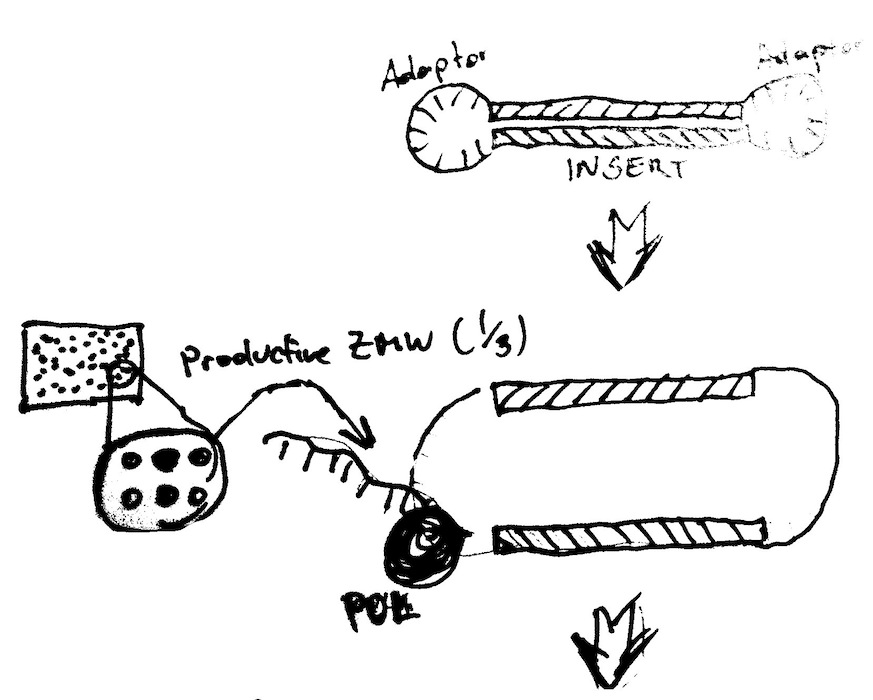

---

## PacBio Basics

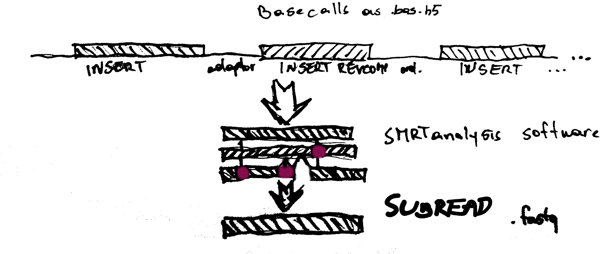

---

## Assembly Basics

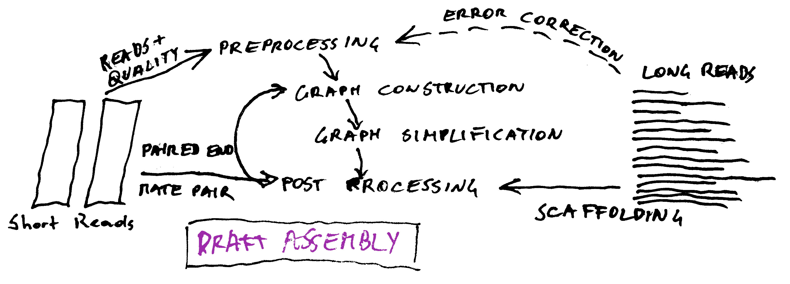

---

### Preprocessing

- Illumina Error Correction: K-mer Spectrum (SGA), Suffix Tree/Array, ... 

- Error Correction of Pacbio reads with Illumina (details later)

- Adapter trimming

- Quality trimming

- Deduplication

Some assemblers depend on other, existing tools to perform these steps or do one or more as part of their pipeline. If so, don't use other tools - see Assemblathon.

---

### Graph Construction

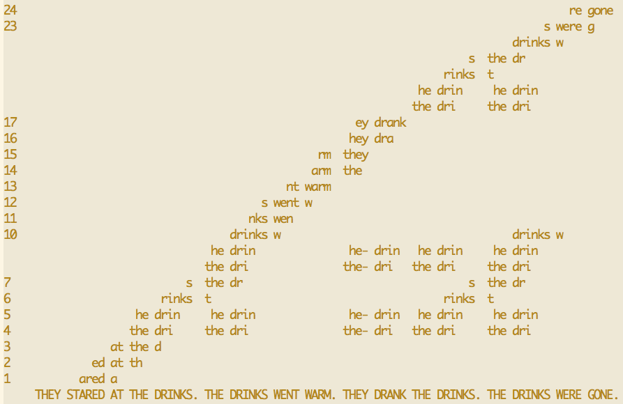

---

### Graph Construction

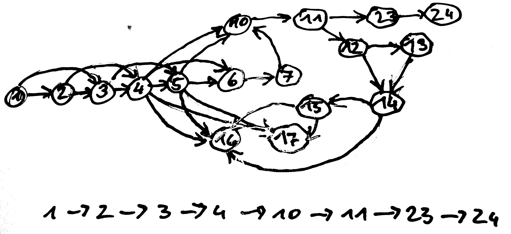

---

### Graph Construction - Path Enumeration

> They stared at the drinks were gone

> They stared at the drinks went were gone

> They stared at the drinks the drinks were gone

> ...

Look for paths that

- traverse every edge once (Euler)
- visit every node once (Hamiltonian)

---

### Graph Construction - Path Enumeration

(THEY ST)ARED AT THE DRINKS. THE DRINKS WENT WARM. THEY DRANK.

--- 

### Graph Construction - Strategies

**Overlap Consensus Layout, eg. SGA**

More or less as shown. Minimum length of overlap *k* is the parameter that
determines the graph complexity. Should ideally be as large as the dataset
allows (sequencing errors, polyploidity). The ideal assembly visits all nodes
exactly once (Hamilton-Path).

String Graphs are a special variant where all transitive edges `((X, Y), (X, Z), (Y, Z))` are reduced to `((X, Z))`, *irreducible edges*. 

--- 

### Graph Construction - Strategies

**K-mer based, eg. Abyss, SOAPdenovo**

Nodes represent all kmers in the reads. Two kmers are connected if there is a
`k-1` overlap between the nodes (de Bruijn graph). The Euler path that visits
each edge exactly once corresponds to a chromosome in an ideal assembly.

K-mer sized (parameter *k*) should be chosen large enough to reduce the number
of wrong connections between contigs, but small enough to allow for errors.

*Hybrid strategies proposed: Combine contig and graph output from two types of assemblers.*

---

### Graph Simplification

Graph structure is very complex due to

- transitive edges like `((1,2), (1,3), (2,3))`

- consecutive nodes like `((1,2), (2,3), (3,4))`

- error reads (branches that converge again later)

- spurious branch points on repeat edges

- dead ends (tips)

---

### Graph Simplification - Node Merging

Collapse nodes that connect unambiguously (without branching) into one node representing the merged sequence.

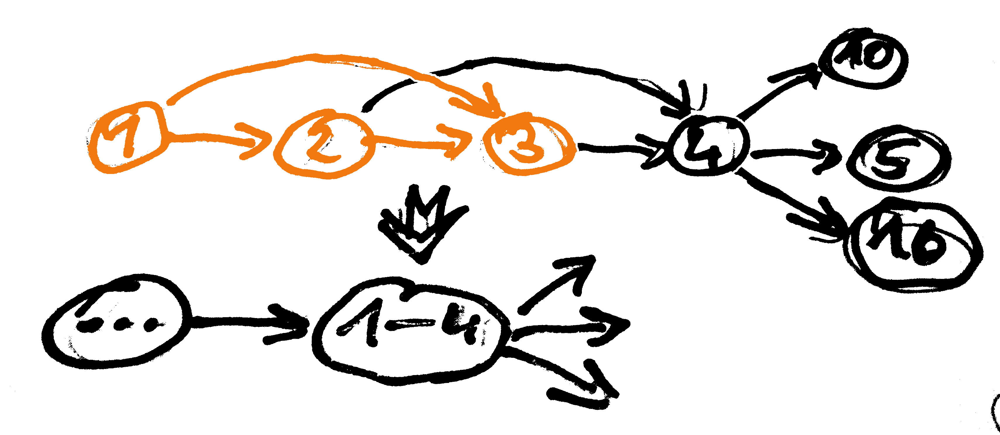

---

### Graph Simplification - Node Merging

Collapse nodes that connect unambiguously (without branching) into one node representing the merged sequence.

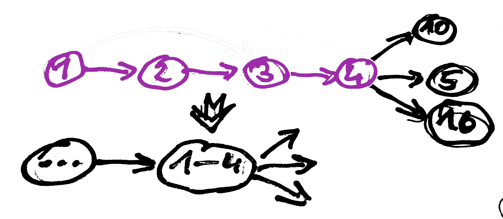

---

### Graph Simplification - Dead End Removal

Sometimes also: tip erosion. Remove all nodes with connections only in one
direction. These can be caused by low coverage regions and read errors. Can
also shorten valid contigs!

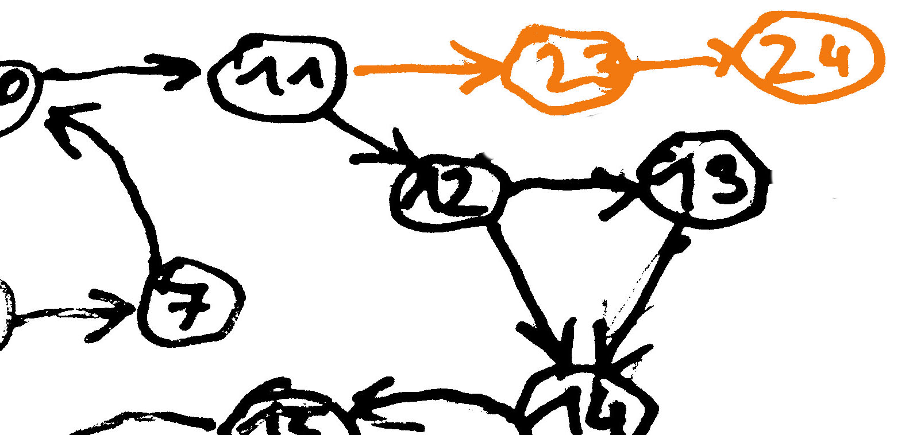

---

### Graph Simplification - Bubble Popping

Bubbles due to sequencing errors or polyploid genomes, heterozygosity.
Selection of branch based on different criteria like coverage, quality.

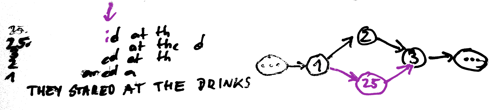

---

### Graph Simplification - Repeat tangles

Formed in repeated regions, were many reconstructions are possible. Resolved by
forming parallel paths. Paired-End constraints can be used to discard invalid
edges (too short, too long reconstruction). 

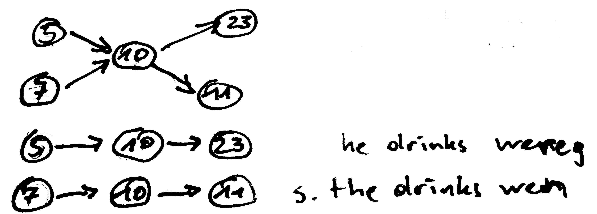

---

### Postprocessing 

**Contigs**: Build contiguous stretches of sequence, filter and correct (consensus)

**Scaffolds**: Either with built-in scaffolder or external program. Most assemblers come with
their own scaffolder for PE or mate pair library information. Using Pacbio CLRs
not yet popular.

Missing sequence information is filled with N (assembly gaps)

---

### Postprocessing - Scaffolding

Use paired end information to join and orient contigs. Can also detect and filter misjoined contigs.

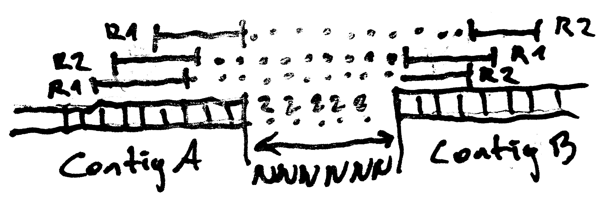

---

## Differences between Assemblers

From the SGA paper:

> [...] We then perform the standard assembly graph post-processing step of removing tips from the graph where a vertex only has a connection in one direction [...]

> we have developed an algorithm [...] similar to the ‘‘bubble-popping’’ ap- proaches taken by de Bruijn graph assemblers [...]

> Similar to other approaches to scaffolding (Pop et al. 2004), our method is based on constructing a graph of the relationships between contigs.

--- 

### Differences between Assemblers

They all follow the same principles! Main "unique selling points" seem to be
algorithms and data structures. The strategies and heuristics employed in graph
simplification and postprocessing make the difference in results.

---

### Differences between Assemblers ... and datasets

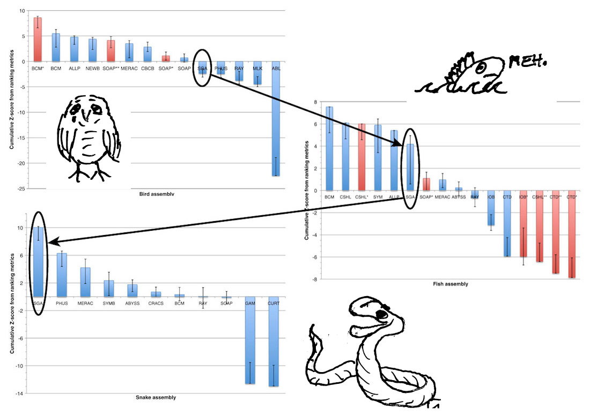

---

# Data Sets and Assembly Results

*Ustilago bromivora*, a fungus with a nice compact genome of about 20Mb. 

---

### Already sequenced relatives: 

- U. maydis, Corn Smut 

17.4Mb in 28 contigs. 

http://www.broadinstitute.org/annotation/genome/ustilago_maydis.2/Info.html

- U. hordei, Covered Smut 

81% of est. 26.1 Mb in 71 supercontigs

25fold coverage with genomic and 10kb paired end library on 454, end-sequencing of a tiled BAC library
assigned to 23 chromosomes with optical mapping

> Linning et al., 2004. Genetics 166: 99-111

http://mips.helmholtz-muenchen.de/genre/proj/MUHDB/About/overview.html

---

## Libraries

### 40000 Pacbio CLRs 

mean length of 3910 bp (median 2903, max 20254), see [report.html](report.html#toc_2)

### 42M Illumina PE100 reads

Library might be problematic. Average insert size estimated at 211bp (+/- 52bp). According to scientist it should be 300-500bp, see [report.html](report.html#toc_8)

---

### Illumina FastQC

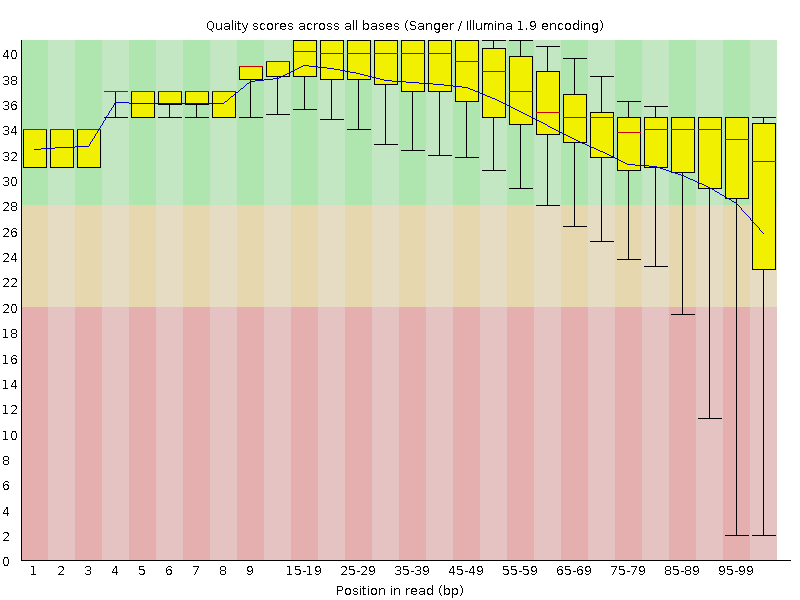

---

### Illumina FastQC

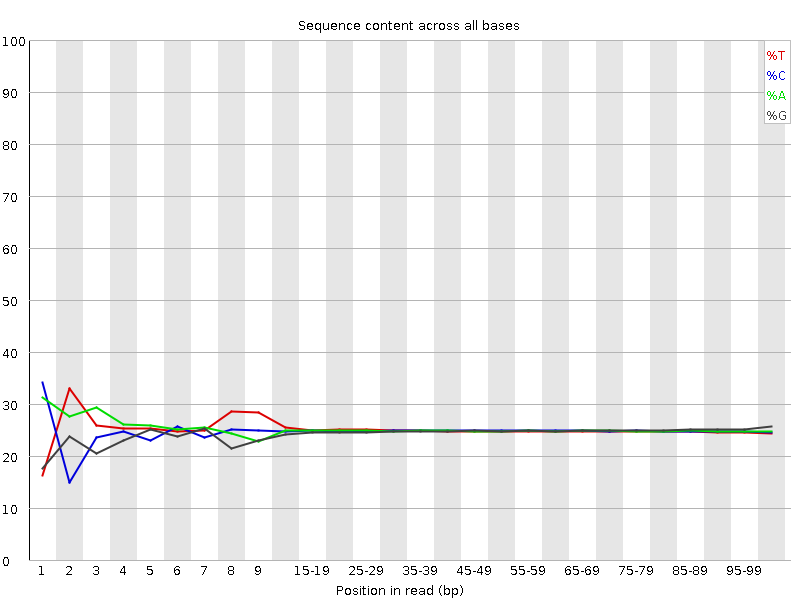

---

### Illumina FastQC

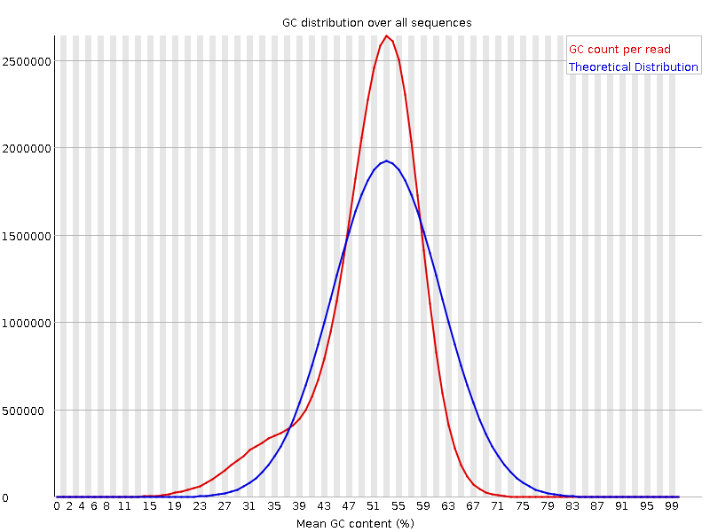

---

### Pacbio FastQC

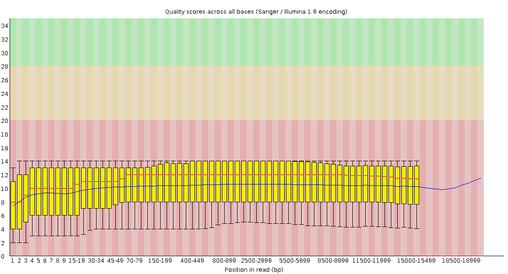

---

### Pacbio FastQC

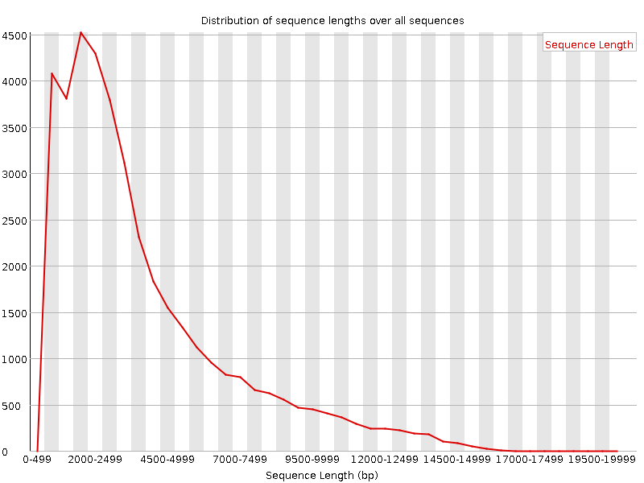

---

### Pacbio FastQC

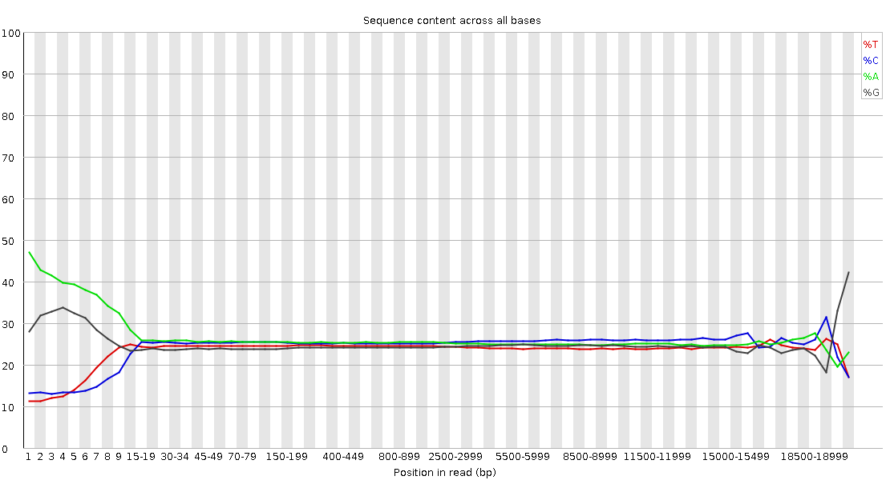

---

### Pacbio FastQC

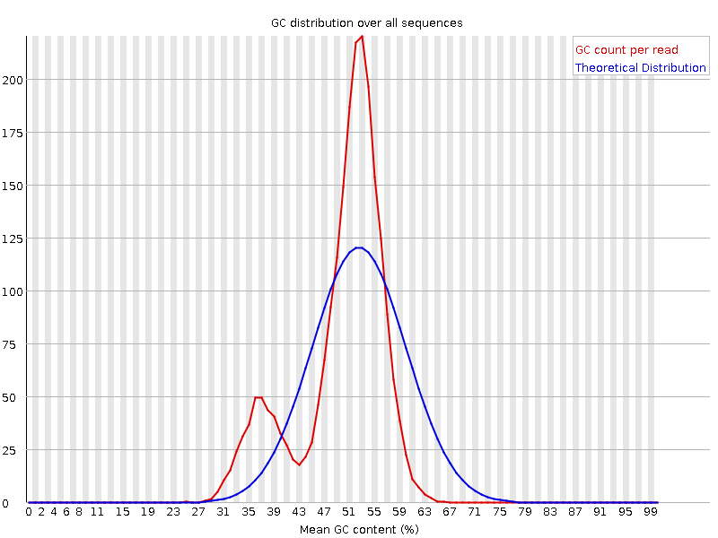

---

## SGA PreQC

Calculates various metrics to compare with test datasets from Assemblathon2:

- estimated genome size
- branching in de Bruijn graphs with different k-mer sizes
- fragment size estimation
- kmer spectrum
- GC biases
- simulated contig length

---

## PreQC

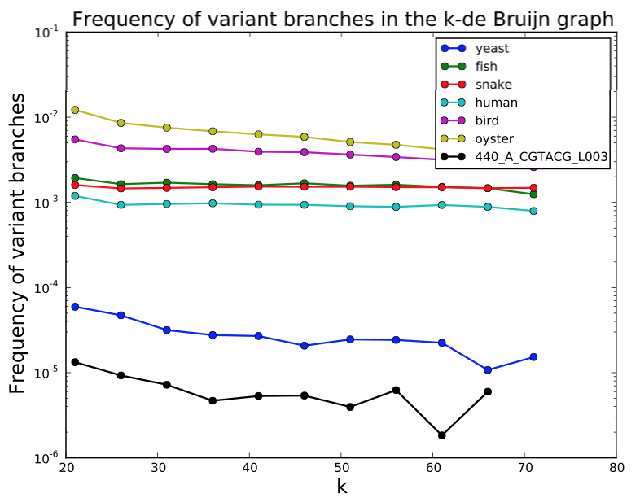

---

## PreQC

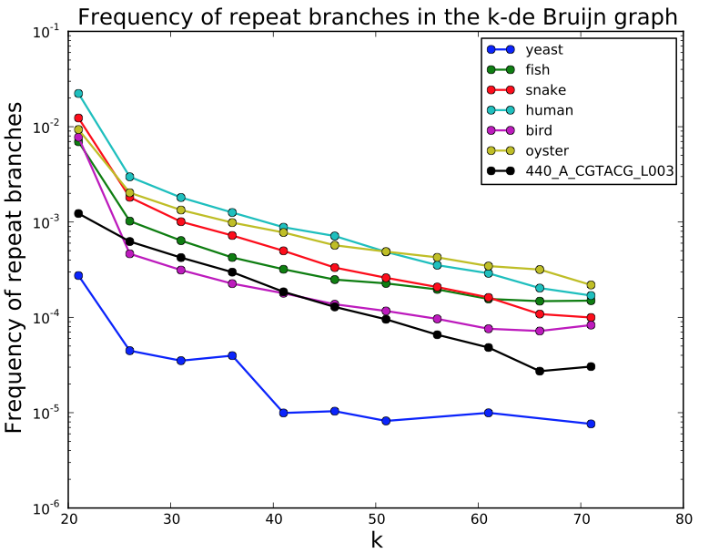

---

## PreQC

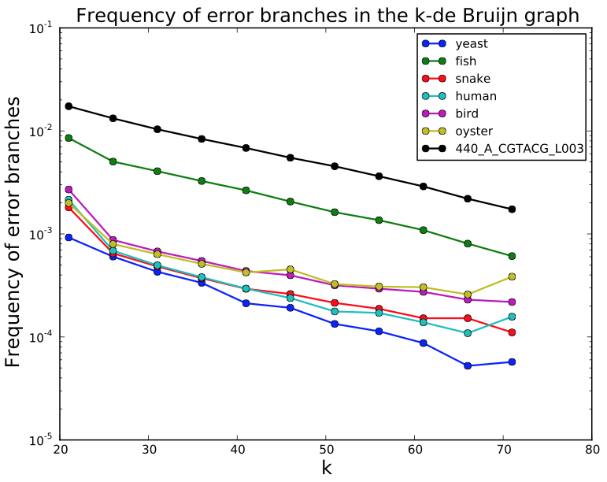

---

## PreQC

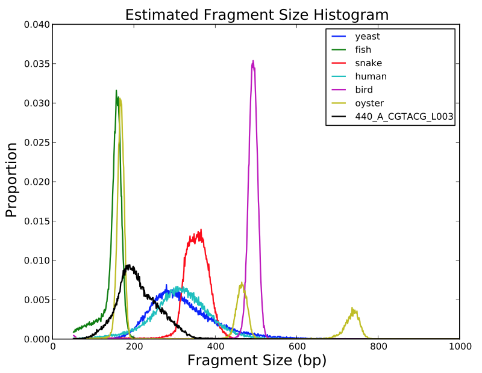

---

## PreQC

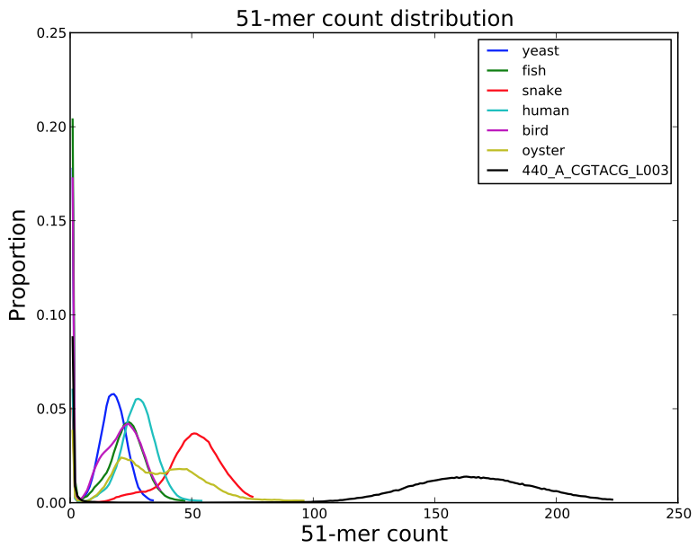

---

## PreQC

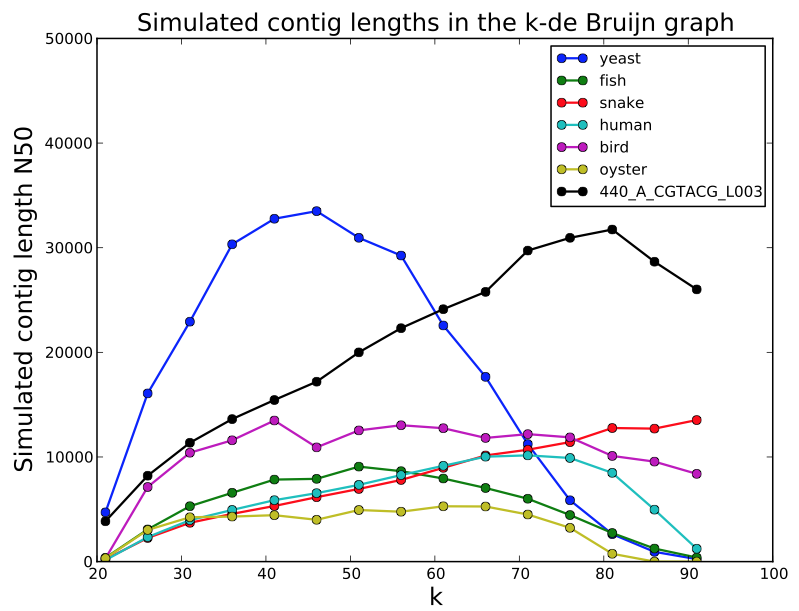

---

## Error Correction Approach

Compensate for high error rate and indel in Pacbio reads by error correcting using relatively accurate Illumina short reads.

- pacBioToCA (based on Celera assembler)

- PreAssembly pipeline (from PacBio SMRTanalysis)

---

### pacBioToCA Error Correction

comes with SMRTanalysis software package, but must be run from command line.

1. Create frg file for Illumina reads
1. Create spec file (by copy&paste...)
1. Run 

	pacBioToCA -length 500 -partitions 200 -l ec_pacbio -t 16 \
	-s pacbio.spec -fastq filtered_subreads.fastq $illuminaFrg

1. wait for ~ 2 days 
1. receive a 250MB file called `ec_pacbio.fastq` and nothing else.

---

### pacBioToCA Error Correction

Pipeline steps:

1. Create a Gatekeeper store with Illumina reads
1. OBT: quality trimming, kmer frequency, overlap kmers
1. OBT: build overlap store
1. OBT: deduplicate reads (needs lotsa memory)
1. OBT: trim reads
1. Overlap: overlap store
1. Overlap: kmer based error correction
1. Overlap: Unitigs
1. ASM: error correction
1. ASM: Unitigs, create fastq, delete everything else

---

### pacbioToCA Error Correction

see [report.html](report.html#toc_17)

- Corrected reads are actually shorter than before.

(no information about mapping to original reads from pipeline)

- Computationally very intense (good for keeping clusters busy)

- Reduction in Depth makes assembly seem infeasible

---

### SMRTanalysis PreAssembler Workflow

could in theory be run from the web interface, but only with PacBio input (error correcting CLRs with circular consensus reads (CCR). Needs .bas.h5 (primary analysis result from sequencer).

1. start a fake job with only the CLRs from web interface
1. interrupt, snatch `settings.xml` and `input.xml` from job directory
1. run 

	smrtpipe.py --distribute --output=result/ \
		--params=settings.xml xml:input.xml

1. wait 1 - ? days depending on alignment parameters

---

### SMRTanalysis PreAssembler Workflow

see [Pipeline output](preassembler/workflow/Workflow.summary.html)

1. filter subreads, create store for short reads
1. align short reads to long (14 hours)
1. layout/consensus (14 hours)
1. create files

Alignment with blasr.

---

### SMRTanalysis PreAssembler Workflow

see [report.html](report.html#toc_32)

- Fewer, even shorter reads

- Bad results, but minimal relaxation of alignment criteria produced ~200GB of alignment files which then could not be read

- Very sensitive to parameters for alignment between PacBio and Illumina Reads

- Mapping information between corrected and original reads, better diagnostics

---

### Resulting Reads

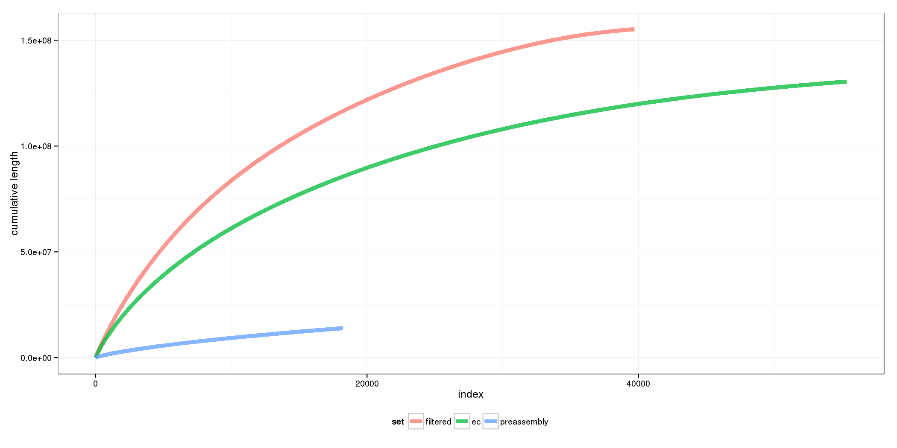

---

## Hierarchical Assembly

Compensate for short read length by assembling high-fidelity Illumina reads (with high coverage) and resolve repeats and gaps using long Pacbio reads.

1. Run standard assembler
1. Use Cerulean or PBJelly to scaffold and fill gaps

Relatively new, few assemblers have native support for including Pacbio CLRs (in contrast to Mate Pair and Sanger reads)

---

### Abyss + Longscaff

Version 1.3.7 from Dec 11 2013 can use Pacbio CLRs internally with BWA version 0.7.5a+ (with bwa mem support).

1. run `abyss-pe` with parameter `k=64` and library paths
1. watch it crash after initial contigging
1. run `bwa mem` manually
1. restart abyss (hooray makefile!)
1. receive fasta and graph files (dot) for unitigs, contigs, scaffolds and long-scaff

---

### Abyss + Longscaff 

> Simpson, JT et al. Genome Res 2009

- Easy to use (once you get around the bug)
- Very fast 

---

### Abyss + Longscaff 

|set | # >2kb | N50 | max |
|:---|-------:|----:|-------:|
| scaffolds | 698 | 52136 | 200210 |
| longscaff | 475 | 81601 | 435667 |

see [report.html](report.html#toc_37)

---

### Abyss + Cerulean

1. run `abyss-pe k=64` (without long read library)
1. align pacbio reads to assembled contigs (*not* scaffolds?) with blasr
1. run Cerulean on alignment and `${name}-contigs.dot`

---

### Abyss + Cerulean

> Deshpande V, et al. Algorithms Bioinformatics 2013

- Also quite easy
- Not scalable: Crashed on different larger dataset 

---

### Abyss + Cerulean

|set | # >2kb | N50 | max |
|:---|-------:|----:|-------:|
| scaffolds | 698 | 52136 | 200210 |
| longscaff | 475 | 81601 | 435667 |
| cerulean | 310 | 106883 | 366413 |

see [report.html](report.html#toc_42)

---

### SGA assembly

String Graph Assembler promises to be more memory-efficient with equally good results. Same first author as abyss.

1. write longish shell script
1. wait comparatively long
1. receive error corrected reads fastq, assembly fasta, not much else

--- 

### SGA assembly

1. Create PreQC report
1. Error Correction using kmer frequencies (3 hours)
1. Assembly
1. Scaffolding: Align reads to contigs using BWA

---

### SGA error correction

discarded ~ 5M reads

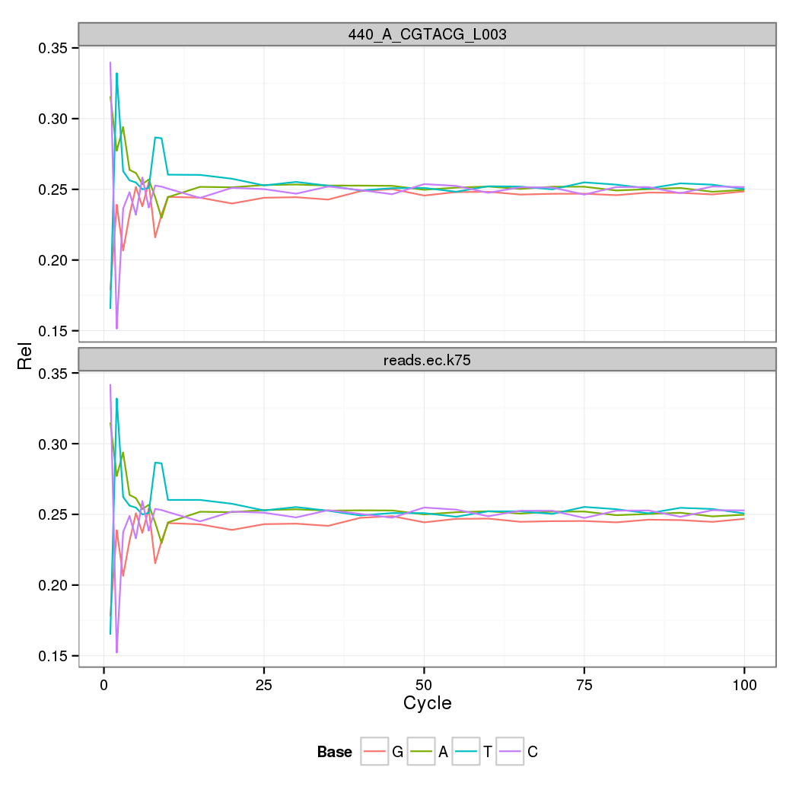

---

### SGA assembly

> Simpson JT. Genome Res. 2012

- more complex workflow, more parameters
- in-built error correction

---

### SGA assembly

|set | # >2kb | N50 | max |
|:---|-------:|----:|-------:|
| SOAP | 521 | 78347 | 280862 |
| SGA | 467 | 57237 | 199401 |
| Abyss | 698 | 51236 | 200210 |

see [report.html](report.html#toc_56)

---

### SOAP denovo

1. create protocol file with parameters
1. write wrapper script for cluster submission
1. wait (~ 14 hours)
1. receive graph files (prop) and statistics

---

### SOAP denovo

> Luo, R. et al. SOAPdenovo2: an empirically improved memory-efficient short-read de novo assembler. Gigascience 1, 18 (2012).

- more complex workflow with more parameters

---

### SOAP denovo

|set | # >2kb | N50 | max |
|:---|-------:|----:|-------:|
| SOAP | 521 | 78347 | 280862 |
| SGA | 467 | 57237 | 199401 |
| Abyss | 698 | 51236 | 200210 |

see [report.html](report.html#toc_64)

---

## PBJelly

Created for filling scaffold gaps. 

1. create Protocol.xml with alignment options and cluster parameters
1. create shell script to run different stages
1. receive `jelly.out.fasta` (do NOT run more than one PBJelly per directory!)

---

## PBJelly

> English AC, et al. PLoS One. 2012

1. Mapping with `blasr`
1. find supporting mappings on gap/contig edges
1. extract sequence information
1. local assembly of pacbio reads

---

## PBJelly

- Some problems: blasr dumped cores for some sequence chunks
- Assembly crashed on certain pacbio reads
- but results are still good!

---

## PBJelly

Gap statistics

|set             | gapped.contigs|  overall|   overall.width|  width.mean|
|:---------------|--------------:|--------:|---------------:|-----------:|
|cerulean        |            316|      799|          529462|     1675.51|
|pbj.cerulean    |            152|      224|           64066|      421.49|
|sga		 |  	      337|      612| 	       17250|       51.19|
|pbj.sga         |             26|       31|             927|       35.65|
|soap		 | 	      514|     3084| 	       33891| 	    65.94|
|pbj.soap        |            246|     2705|           19088|       77.59|

---

## PBJelly

|set | # >2kb | N50 | max |
|:---|-------:|----:|-------:|
| sga | 183 | 234931 | 767671 |
| SOAP | 174 | 201830 | 541843 |
| Cerulean | 238 | 159023 | 489237 |

---

## All Contig Stats

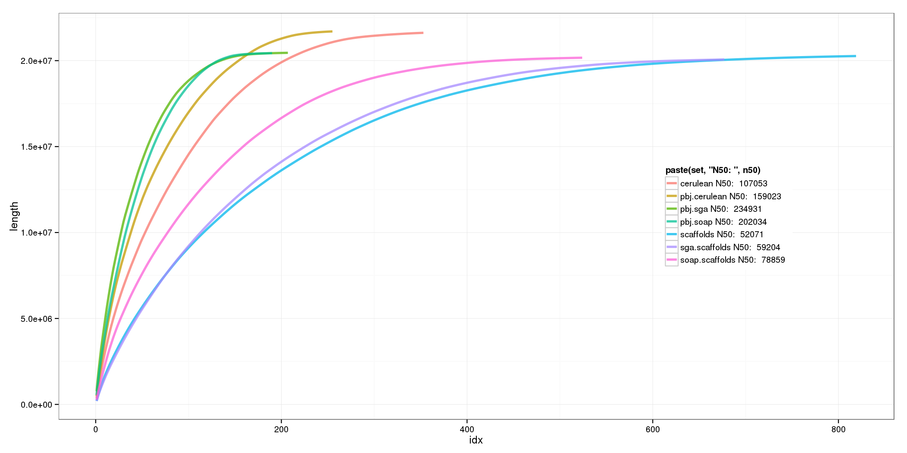

---

## All Contig Stats

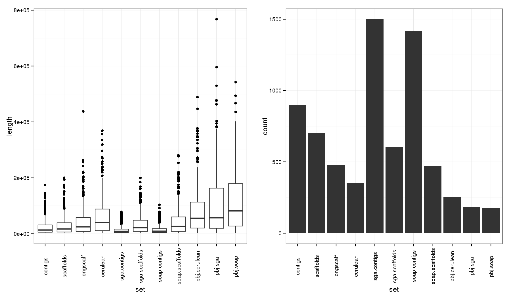

---

## Conclusion

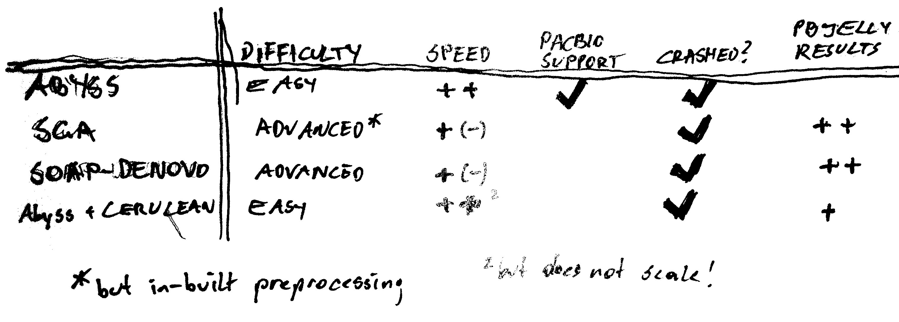

---

# Quality Checks for Assembly Selection

---

## Size Is Not Everything 
## **Quality Assessment needed.**

But we do not have the luxury of **Assemblathon** or **GAGE** to have a reference to compare to!

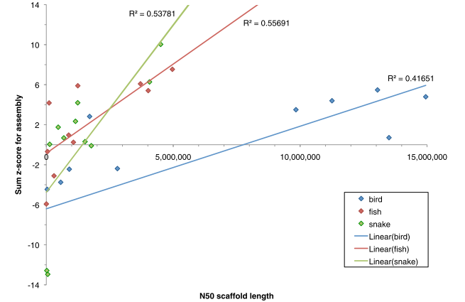

---

### Alignment to Close Relative (*U. hordei*)

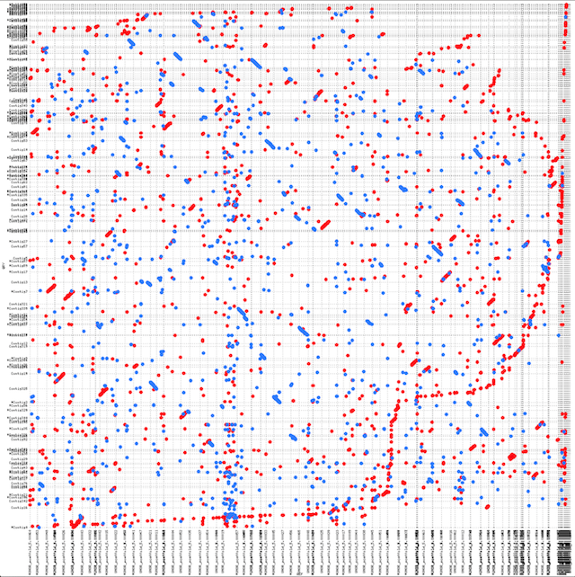

---

### Alignment of PacBio reads

Aligned with `bwa mem -a -T 60 -k 16 -A 2 -L 4 -t 8 -S -P -k 32`

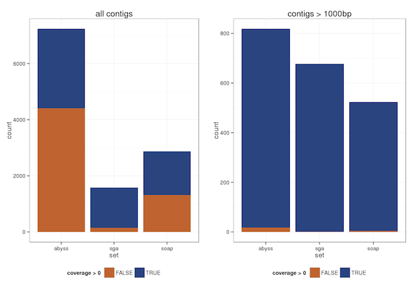

---

### Alignment of PacBio reads

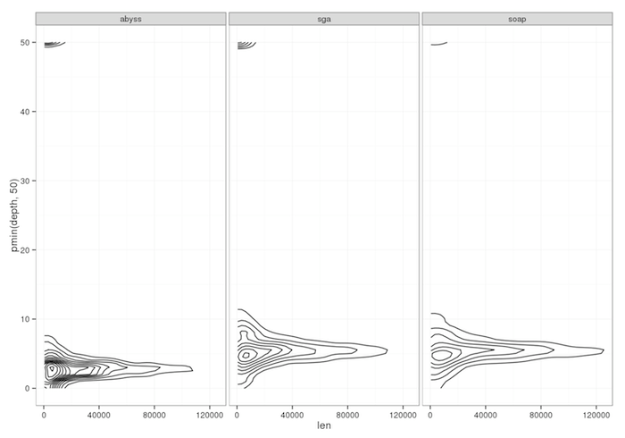

A number of contigs with very high depth (>300) were found - A random BLAST produced rDNA.

---

### Alignment of PacBio reads

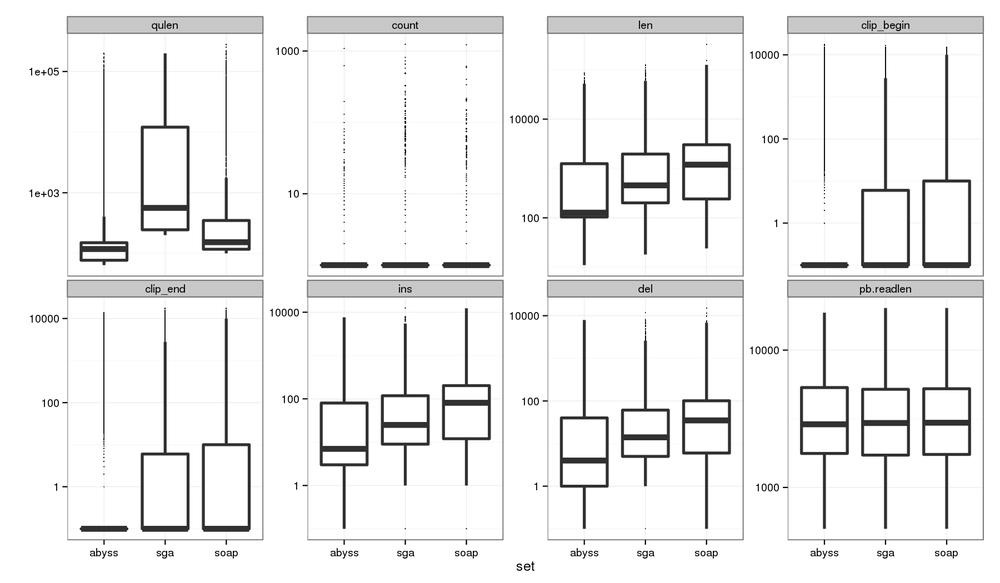

---

### CEGMA: Check for Presence of Core Genes

> Parra G, et al. CEGMA: a pipeline to accurately annotate core genes in eukaryotic genomes. Bioinformatics. 2007;23(9):1061–7

- Select 1788 KOGs (eukaryotic orthologous groups) from genes with high identity in organisms from Yeasts to Humans. 
- Use BLAST to find candidate regions
- refine with GeneWise and HMMER
- output GFF and report

Could be used to examine tentative gene structure!

---

### CEGMA

---

### REAPR

> Hunt M, et al. Genome Biol. 2013

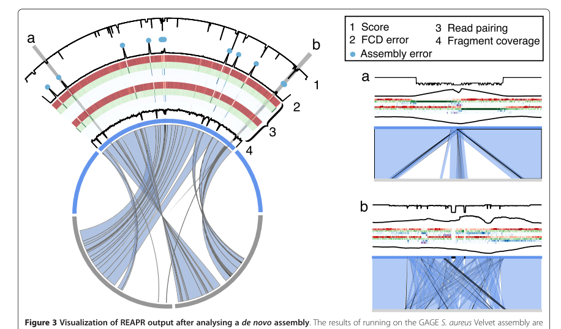

---

### REAPR

- align reads back to assembly
- infer mismatches and structural errors from paired information (expected insert size distribution)
- analyse observed fragment coverage distribution (FCD) vs expected FCD
- warn on soft-clipping

---

#### Literature

1. Simpson JT, Wong K, Jackman SD, et al. ABySS: a parallel assembler for short read sequence data. Genome Res. 2009;19(6):1117–23.
2. Bradnam KR, Fass JN, Alexandrov A, et al. Assemblathon 2: evaluating de novo methods of genome assembly in three vertebrate species. Gigascience. 2013;2(1):10. 
3. Deshpande V, Fung E, Pham S, Bafna V. Cerulean: A hybrid assembly using high throughput short and long reads. Algorithms Bioinforma. 2013;8126:349–363. 
4. Simpson JT, Durbin R. Efficient de novo assembly of large genomes using compressed data structures. Genome Res. 2012;22(3):549–56. 
5. Simpson J. Exploring Genome Characteristics and Sequence Quality Without a Reference. arXiv Prepr. 2013:1–29. 
6. Salzberg SL, Phillippy AM, Zimin A, et al. GAGE: A critical evaluation of genome assemblies and assembly algorithms. Genome Res. 2012;22(3):557–67. 
7. English AC, Richards S, Han Y, et al. Mind the gap: upgrading genomes with Pacific Biosciences RS long-read sequencing technology. PLoS One. 2012;7(11):e47768. 
8. El-Metwally S, Hamza T, Zakaria M, Helmy M. Next-Generation Sequence Assembly: Four Stages of Data Processing and Computational Challenges Markel S, ed. PLoS Comput. Biol. 2013;9(12):e1003345. 
9. Hunt M, Kikuchi T, Sanders M, et al. REAPR: a universal tool for genome assembly evaluation. Genome Biol. 2013;14(5):R47. 
10. Luo R, Liu B, Xie Y, et al. SOAPdenovo2: an empirically improved memory-efficient short-read de novo assembler. Gigascience. 2012;1(1):18. 
11. Boetzer M, Pirovano W. Toward almost closed genomes with GapFiller. Genome Biol. 2012;13(6):R56. 
12. Parra G, Bradnam K, Korf I. CEGMA: a pipeline to accurately annotate core genes in eukaryotic genomes. Bioinformatics. 2007;23(9):1061–7. 
